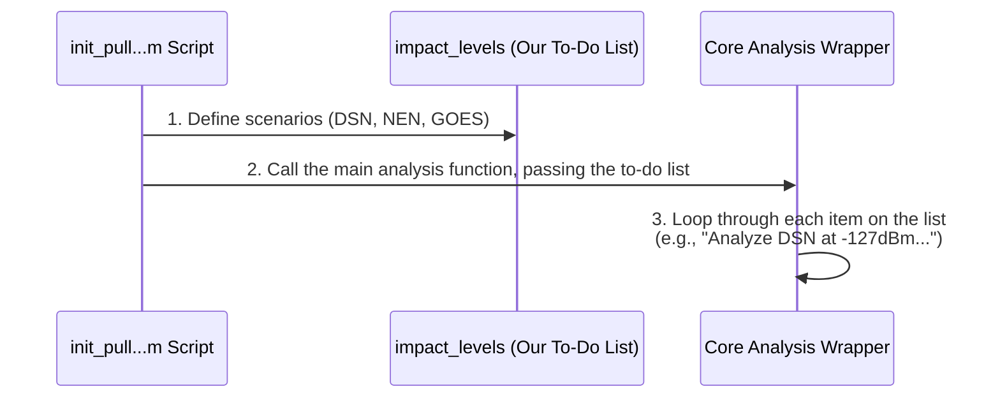

# Chapter 1: Interference Scenario Definition

Welcome to the `7GHz_plot_DSN_EESS` project! This tutorial will guide you through the key components of this powerful analysis tool. We'll start at the very beginning: telling the simulation exactly what we want it to do.

Imagine you're about to cook a big meal with several different recipes. Before you start chopping vegetables or preheating the oven, you need a plan. Which dishes will you make? What are the ingredients for each? This planning step is crucial, and it's exactly what we'll cover in this chapter.

## What's the Plan? The `impact_levels` To-Do List

In our project, we need to analyze how a new wireless service might interfere with existing satellite communication systems. To do this, we can't just tell the computer to "check for interference." We need to be very specific.

*   **Which systems** should we check? (e.g., NASA's Deep Space Network)
*   At what **specific levels of interference** should we measure the impact?

This is where our "recipe book" comes in. In our main script, `init_pull_DSN_excel_plot_rev4_pop_impact.m`, we define a special variable called `impact_levels` that acts as a precise to-do list for the entire analysis.

### Creating the Recipe Book

Let's look at how this to-do list is created in the code. It's a structure called a "cell array," which is like a spreadsheet table that can hold different types of data.

First, we create an empty 3x2 table.

```matlab
impact_levels=cell(3,3);
```

This line prepares an empty container for our recipes.

Next, we fill in the first recipe. We tell the simulation to analyze the **Deep Space Network (DSN)** system.

```matlab
impact_levels{1,1}='DSN';
impact_levels{1,2}=-127:10:-77;
```
*   `{1,1}` means "row 1, column 1". We put the name 'DSN' here.
*   `{1,2}` means "row 1, column 2". We specify the interference levels to test. The code `-127:10:-77` is MATLAB's way of saying: "Start at -127, count up by 10, and stop when you get to -77." This creates a list: `[-127, -117, -107, -97, -87, -77]`.

We then add two more "recipes" for other systems, the **Near Earth Network (NEN)** and the **GOES** satellite system, each with its own set of interference levels.

```matlab
impact_levels{2,1}='NEN';
impact_levels{2,2}=-127:10:-77;

impact_levels{3,1}='GOES';
impact_levels{3,2}=-130:10:-80;
```

### The Final To-Do List

After running these lines, if you were to display the `impact_levels` variable in MATLAB, it would look like this:

```
impact_levels =
  3×2 cell array
    'DSN'     {1×6 double}
    'NEN'     {1×6 double}
    'GOES'    {1×6 double}
```

This is our complete to-do list. It clearly instructs the analysis engine:
1.  **For the DSN system**, run the analysis for interference levels of -127 dBm, -117 dBm, -107 dBm, and so on.
2.  **For the NEN system**, do the same.
3.  **For the GOES system**, run the analysis for interference levels of -130 dBm, -120 dBm, etc.

By defining our scenarios this way, we ensure our study is organized, systematic, and easy to repeat or modify later.

## How is This To-Do List Used?

So, we've created our recipe book. How does the "chef" (our main analysis engine) use it?

The `init_pull...` script defines `impact_levels` and then passes it along to the core workhorse of the project. Think of it like handing your to-do list to a colleague who will perform the tasks.

This process is visualized below:



The key hand-off happens in this line of code at the end of the script:

```matlab
% We're calling the main wrapper function and passing many settings,
% including our list of scenarios.
wrapper_bugsplat_DSN_EESS_rev15(..., impact_levels, ...);
```
*(Note: `...` represents other arguments that aren't important for this chapter.)*

This line takes our carefully prepared `impact_levels` variable and hands it over to the main processing function. That function will then systematically work through each task on the list. We'll learn more about this powerful function in the chapter on the [Core Analysis Wrapper (`wrapper_bugsplat_DSN_EESS_rev15`)](04_core_analysis_wrapper___wrapper_bugsplat_dsn_eess_rev15___.md).

## Conclusion

In this chapter, we learned about the most fundamental concept for configuring a study: the **Interference Scenario Definition**. We saw how the `impact_levels` variable acts as a clear and organized "to-do list" or "recipe book" that tells the simulation exactly which systems to analyze and at what specific interference thresholds. This simple yet powerful structure is the foundation for the entire analysis pipeline.

Now that we have our "what to do" list, let's move on and look at the main script that manages the "how to do it."

Next up: [Analysis Pipeline Controller](02_analysis_pipeline_controller_.md)

---

Generated by [AI Codebase Knowledge Builder](https://github.com/The-Pocket/Tutorial-Codebase-Knowledge)