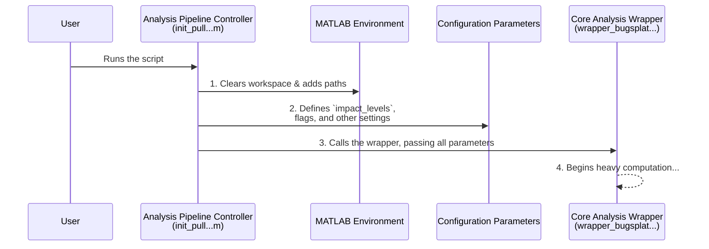

# Chapter 2: Analysis Pipeline Controller

In the last chapter, [Interference Scenario Definition](01_interference_scenario_definition_.md), we learned how to create a very specific "to-do list" called `impact_levels` that tells our program *what* to analyze. Now, let's zoom out and look at the script that acts as the central command center for the entire project.

Imagine you are the director of a movie. You don't operate the camera or act in the scenes yourself. Instead, you sit in your director's chair, make sure the lighting is right, the actors know their lines, and the cameras are in position. When everything is perfectly set up, you yell "Action!" to start the scene.

Our **Analysis Pipeline Controller**, the script named `init_pull_DSN_excel_plot_rev4_pop_impact.m`, is that movie director. It's the main script you run. Its job is to set up the entire "scene" for our analysis and then give the final "go" command.

## The Three Main Jobs of the Controller

This controller script is responsible for three critical tasks, all conveniently located in one place:

1.  **Setting the Stage:** It prepares the MATLAB environment by clearing old data and telling MATLAB where to find all the necessary tools and functions.
2.  **Defining the Script:** It gathers all the "props" and "lines" for the actors. This includes defining our `impact_levels` to-do list, setting file paths for data, and flipping switches (called "flags") that control how the analysis will run.
3.  **Yelling "Action!":** It makes the final call to the main "workhorse" function, handing over all the prepared settings to begin the heavy-duty calculations.

This approach is powerful because it separates *configuration* (the easy-to-change settings) from *execution* (the complex underlying code). You can change the entire analysis just by tweaking a few lines in this one controller script, without ever needing to touch the complicated machinery behind the scenes.

## A Step-by-Step Walkthrough

Let's look at how the `init_pull...m` script performs its three jobs.

### 1. Setting the Stage: Preparing the Workspace

The very first thing a good director does is clear the set to make sure there's no clutter from a previous scene. Our script does the same for MATLAB.

```matlab
clear;
clc;
close all;
```

*   `clear;`: Wipes all previous variables from MATLAB's memory.
*   `clc;`: Clears any old text from the command window.
*   `close all;`: Closes any graphs or figures that might be open.

This ensures we start with a clean slate every time.

Next, the script tells MATLAB where to find all the helper functions it will need. Think of this as giving your crew a map to the tool shed.

```matlab
% Define the main project folder
folder1='C:\Users\nlasorte\...\7GHz DSN Contour Plots';
cd(folder1); % Go to that folder

% Add folders with helper functions to MATLAB's path
addpath('C:\Users\nlasorte\...\Basic_Functions');
addpath('C:\Users\nlasorte\...\Generic_Bugsplat');
```
*(Note: `...` is used to shorten the file paths for clarity.)*

The `addpath` commands are crucial. They allow our main script to use code from other folders, which is how we use our [Modular Function Libraries](05_modular_function_libraries_.md).

### 2. Defining the Script: Setting Parameters

With the stage set, the director now defines the scene. In our case, this means setting up all the variables that will guide the analysis.

This includes defining our `impact_levels` to-do list from Chapter 1:

```matlab
impact_levels=cell(3,3);
impact_levels{1,1}='DSN';
impact_levels{1,2}=-127:10:-77;
% ... more definitions for NEN and GOES
```

It also involves setting simple on/off switches, called flags, to control the program's behavior. A `1` usually means "on" and a `0` means "off".

```matlab
parallel_flag=0;      % Don't use parallel processing
tf_recalculate=0;     % Don't re-run calculations if results already exist
tf_plot_bugsplat=1;   % Yes, create the output plot!
```

These flags are incredibly useful. For example, if you only want to generate the final plot and not re-run the entire time-consuming analysis, you can simply set `tf_recalculate=0` and `tf_plot_bugsplat=1`. We will cover these in much more detail in the next chapter, [Execution Configuration Flags](03_execution_configuration_flags_.md).

### 3. Yelling "Action!": Launching the Analysis

Finally, with every setting in place, the controller script makes the call to start the main analysis. It does this by calling a single, powerful function and passing it all the parameters we just defined.

```matlab
% Now running the simulation
wrapper_bugsplat_DSN_EESS_rev15(app, rev_folder, parallel_flag, ...
    impact_levels, tf_plot_bugsplat, ...);
```
*(Note: `...` represents other arguments we've defined.)*

This one line is the "Action!" moment. It hands over our entire plan (`impact_levels`), all our control switches (`parallel_flag`, `tf_plot_bugsplat`), and all other settings to the main engine. This engine, the [Core Analysis Wrapper (`wrapper_bugsplat_DSN_EESS_rev15`)](04_core_analysis_wrapper___wrapper_bugsplat_dsn_eess_rev15___.md), then takes over and performs all the complex calculations.

## Under the Hood: The Flow of Control

The entire process can be visualized as a clear sequence of commands, managed by our controller.



As you can see, the `Analysis Pipeline Controller` doesn't do the heavy lifting itself. It's a manager, organizing everything and then delegating the hard work to the specialist `Core Analysis Wrapper`.

## Conclusion

In this chapter, we've seen how the `init_pull_DSN_excel_plot_rev4_pop_impact.m` script acts as the master **Analysis Pipeline Controller**. It provides a single, centralized place to:

*   Prepare the MATLAB environment.
*   Configure every important parameter for your study.
*   Launch the entire analysis with one command.

This clean separation between configuration and execution makes the project flexible, powerful, and easy to use. You can direct a whole new analysis just by changing a few lines in this one script, just like a director changing the setup for a new scene.

In our walkthrough, we saw several "flag" variables like `tf_plot_bugsplat` that act as on/off switches. In the next chapter, we'll take a much closer look at these powerful controls.

Next up: [Execution Configuration Flags](03_execution_configuration_flags_.md)

---

Generated by [AI Codebase Knowledge Builder](https://github.com/The-Pocket/Tutorial-Codebase-Knowledge)