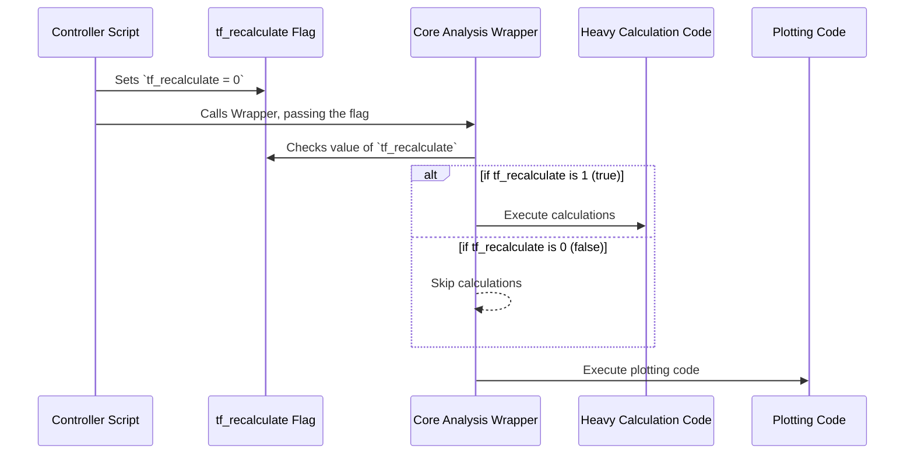

# Chapter 3: Execution Configuration Flags

In the last chapter, [Analysis Pipeline Controller](02_analysis_pipeline_controller_.md), we saw how the main script acts like a movie director, setting up everything before yelling "Action!". We briefly noticed some variables like `tf_plot_bugsplat` that looked like on/off switches.

In this chapter, we'll zoom in on these crucial controls. They are the "settings panel" for our entire analysis, allowing us to be efficient and flexible.

## The Problem: "I Just Want to Change the Plot Title!"

Imagine you've just spent four hours running a complete analysis. The calculations are done, the data is processed, and a beautiful map plot is generated. You look at it and realize... you made a typo in the plot's title.

What do you do? Do you have to run the entire four-hour analysis all over again just to fix one word? That would be incredibly frustrating and a huge waste of time.

This is the exact problem that **Execution Configuration Flags** solve. They are simple on/off switches that let you tell the script: "Hey, you don't need to re-do all that heavy math. Just skip to the end and re-draw the plot for me."

## What Are These Flags?

A "flag" in this project is just a variable that you set to either `1` (which means "on" or "true") or `0` (which means "off" or "false").

Think of them like the light switches in your house. You don't rewire the building's electrical system every time you want to turn on a lamp; you just flip a switch. These flags work the same way for our code.

In our project, we use a simple naming convention: most flags start with `tf_`, which stands for **T**rue/**F**alse. This makes them easy to spot.

Here are a few of the most important flags you'll find in the [Analysis Pipeline Controller](02_analysis_pipeline_controller_.md) script (`init_pull...m`):

```matlab
% --- Main Control Switches ---

tf_recalculate=0;   % Set to 1 to re-run all heavy calculations.
tf_plot_bugsplat=1; % Set to 1 to generate the final contour map plot.
tf_repull_excel=0;  % Set to 1 to re-read the data from the source Excel file.
```

Let's see how we can use these switches to solve our "typo" problem.

### How to Use the Flags

Let's imagine two common scenarios.

#### Scenario 1: The First Big Run

When you're running the analysis for the very first time, you need to do everything: calculate the data, process it, and create the plot. So, you would set your flags like this:

```matlab
% Run everything from scratch
tf_recalculate=1;
tf_plot_bugsplat=1;
```

*   `tf_recalculate=1`: This tells the script, "Yes, please perform all the time-consuming interference calculations."
*   `tf_plot_bugsplat=1`: This tells the script, "And yes, once the calculations are done, please generate the final map plot."

This run might take a few hours, but it does all the necessary work.

#### Scenario 2: Just Re-drawing the Plot

Now, let's say the first run is complete, but you want to change the plot's color scheme or fix a title. You don't need to re-do the math! The results from the first run are already saved (we'll learn more about this in the [Data Caching](06_data_caching_.md) chapter).

You can go back to your controller script and just flip the switches:

```matlab
% Skip the math, just make the plot again
tf_recalculate=0;
tf_plot_bugsplat=1;
```

*   `tf_recalculate=0`: This tells the script, "**No, do not** perform the heavy calculations. Please skip that entire section and use the results you saved from last time."
*   `tf_plot_bugsplat=1`: This tells the script, "Yes, please generate the map plot."

When you run the script with these settings, it might finish in just a few seconds! It skips the four-hour calculation and jumps straight to the plotting step. You've just saved yourself hours of waiting.

## Under the Hood: How Do Flags Actually Work?

The magic behind flags is surprisingly simple. The [Analysis Pipeline Controller](02_analysis_pipeline_controller_.md) passes these `1`s and `0`s to the main workhorse function. Inside that function, the code is full of simple "if" statements that check the value of each flag before running a block of code.

Think of it as a series of checkpoints. At each checkpoint, the program looks at a flag to decide whether to proceed or take a detour.



The `Core Analysis Wrapper` essentially asks, "Is `tf_recalculate` set to 1?" If the answer is no, it just skips the entire chunk of code related to calculations and moves on to the next step.

Here is what that looks like in simplified code inside the [Core Analysis Wrapper (`wrapper_bugsplat_DSN_EESS_rev15`)](04_core_analysis_wrapper___wrapper_bugsplat_dsn_eess_rev15___.md):

```matlab
% This code is INSIDE the main wrapper function

% Check the recalculate flag
if tf_recalculate == 1
    disp('Flag is ON. Starting heavy calculations...');
    % ... many lines of time-consuming code run here ...
else
    disp('Flag is OFF. Skipping calculations.');
    % ... code to load previously saved results runs here ...
end

% Check the plot flag
if tf_plot_bugsplat == 1
    disp('Flag is ON. Creating the plot...');
    % ... code to draw the map runs here ...
end
```

As you can see, the `if...else...end` block acts as a gate. The `tf_recalculate` flag is the key that opens the gate to the heavy calculations. If the flag is `0`, that gate stays closed, and the program takes a much faster path.

## Conclusion

In this chapter, we learned about the power of **Execution Configuration Flags**. These simple `tf_` variables, which you set to `1` (on) or `0` (off), act as a settings panel for our analysis.

*   They provide **flexibility** to control which parts of the script run.
*   They save enormous amounts of **time** by allowing us to skip steps that are already complete.

By understanding and using flags like `tf_recalculate` and `tf_plot_bugsplat`, you gain precise control over the analysis pipeline, making you a much more efficient and effective user of this tool.

So far, we've defined *what* to study with `impact_levels` and learned how to control the process with flags. Now, it's time to meet the main engine that all these settings control.

Next up: [Core Analysis Wrapper (`wrapper_bugsplat_DSN_EESS_rev15`)](04_core_analysis_wrapper___wrapper_bugsplat_dsn_eess_rev15___.md)

---

Generated by [AI Codebase Knowledge Builder](https://github.com/The-Pocket/Tutorial-Codebase-Knowledge)