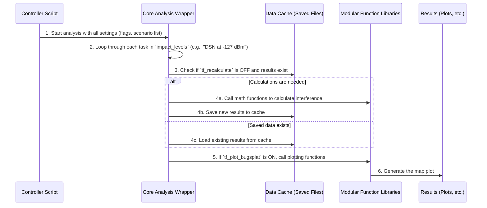

# Chapter 4: Core Analysis Wrapper (`wrapper_bugsplat_DSN_EESS_rev15`)

In the previous chapters, we've acted like managers preparing for a big project.
1.  We created a specific to-do list: the [Interference Scenario Definition](01_interference_scenario_definition_.md).
2.  We organized all our settings in a central command center: the [Analysis Pipeline Controller](02_analysis_pipeline_controller_.md).
3.  We learned to use on/off switches to control the workflow: the [Execution Configuration Flags](03_execution_configuration_flags_.md).

Now, it's time to hand over all our plans and settings to the expert who does the actual work. In our project, that expert is a powerful, all-in-one function called `wrapper_bugsplat_DSN_EESS_rev15`.

## The Specialized Engine Analogy

Imagine you're building a custom car. You, as the designer, choose the paint color, the type of tires, and the style of the seats. You write down all these specifications. But you don't build the engine yourself. Instead, you send your specifications to a specialized factory that takes your list and builds a high-performance engine exactly to your requirements.

The `wrapper_bugsplat_DSN_EESS_rev15` function is that engine factory. It's the central "workhorse" of our entire project. It's a complex and powerful piece of code, but its beauty is that **we don't need to understand its every internal detail.** We just need to know what to give it (our specifications) and what it will give us back (the results).

This concept is called a **wrapper** because it "wraps up" all the complicated steps of the analysis into a single, neat package.

## Feeding the Engine: The Inputs

Our [Analysis Pipeline Controller](02_analysis_pipeline_controller_.md) script (`init_pull...m`) spends most of its time preparing the "specifications" for this engine. When everything is ready, it makes a single function call, handing everything over.

Let's look at a simplified version of that final "Action!" call from our controller script:

```matlab
% Call the main engine, passing all our settings
wrapper_bugsplat_DSN_EESS_rev15(...
    impact_levels, ...
    tf_recalculate, ...
    tf_plot_bugsplat, ...
    rev_folder ...
);
```
*Note: The `...` represents many other settings that are also passed along.*

This single line of code bundles up all our hard work and sends it to the wrapper. Let's look at what we're handing over:
*   `impact_levels`: Our "to-do list" telling the engine which systems to analyze and at what interference levels.
*   `tf_recalculate`: The "on/off" switch that tells the engine whether to perform heavy calculations or use saved results.
*   `tf_plot_bugsplat`: The "on/off" switch that tells the engine whether to create the final map plot.
*   `rev_folder`: The file path telling the engine where to save its results.

The wrapper function is designed to accept all these settings as inputs. It's like filling out an order form for our engine factory.

## Under the Hood: The Automated Assembly Line

So what happens after we press the "run" button and this wrapper function is called? While we don't need to be mechanics, it's helpful to have a general idea of the assembly line process inside.

The wrapper acts as a supervisor for an automated assembly line. It takes our order form (the input arguments) and directs a series of steps.



As you can see, the wrapper is an intelligent supervisor.
1.  It first checks our `impact_levels` to-do list to see what work needs to be done.
2.  Then, for each task, it checks our `tf_recalculate` flag.
    *   If the flag is ON (`1`), it calls other helper functions from our [Modular Function Libraries](05_modular_function_libraries_.md) to perform the heavy math.
    *   If the flag is OFF (`0`), it knows to skip the math and instead load the results from a previous run, a process we'll explore in the [Data Caching](06_data_caching_.md) chapter.
3.  Finally, it checks the `tf_plot_bugsplat` flag to decide whether to call the plotting functions to generate our final map.

### A Glimpse at the Code's Blueprint

The actual code for `wrapper_bugsplat_DSN_EESS_rev15.m` is very long and complex, but its basic structure follows the logic we just described. Here is a highly simplified "blueprint" of what it looks like:

```matlab
% This is a simplified blueprint of wrapper_bugsplat_DSN_EESS_rev15.m

function wrapper_bugsplat_DSN_EESS_rev15(..., impact_levels, tf_recalculate, ...)
    % Loop through each scenario (e.g., DSN, NEN, GOES) from the to-do list
    for i = 1:size(impact_levels, 1)
        system_name = impact_levels{i, 1};
        levels_to_check = impact_levels{i, 2};

        % Check the flag: should we do the heavy math?
        if tf_recalculate == 1
            % Call a specialized function to do the hard work
            run_heavy_calculations(system_name, levels_to_check);
        else
            % Skip the math and load saved data instead
            load_saved_data(system_name);
        end
    end

    % After all scenarios are processed, check the plotting flag
    if tf_plot_bugsplat == 1
        % Call another function to create the final map
        generate_final_plot();
    end
end
```
This blueprint clearly shows how the wrapper uses our `impact_levels` list to loop through the work and uses our `tf_` flags in `if` statements to control the workflow.

## The Final Product: The Output

After the wrapper engine has finished its work, it leaves behind the finished products:
*   **Data Files:** It saves `.mat` files containing all the calculation results into the `rev_folder` we specified. This is crucial for being able to re-plot without re-calculating.
*   **Plots:** If requested (`tf_plot_bugsplat = 1`), it generates and saves the final "bugsplat" contour maps as image files.
*   **Command Window Output:** It prints status updates and final statistics, like the population impact numbers, to the MATLAB command window.

## Conclusion

In this chapter, we've met the workhorse of our project: the **Core Analysis Wrapper (`wrapper_bugsplat_DSN_EESS_rev15`)**. We learned that:

*   It acts like a specialized engine that takes all our configurations as input.
*   It encapsulates (or "wraps") all the complex analysis steps into a single function call.
*   This design allows us to focus on the "what" (our settings) and not the "how" (the complex internal code).
*   It intelligently uses our flags and scenario list to execute the analysis efficiently.

This powerful engine isn't a single, monolithic piece of code. Just like a real engine is built from many smaller parts (pistons, valves, etc.), our wrapper is built by calling many smaller, more focused helper functions. We'll explore these reusable building blocks in the next chapter.

Next up: [Modular Function Libraries](05_modular_function_libraries_.md)

---

Generated by [AI Codebase Knowledge Builder](https://github.com/The-Pocket/Tutorial-Codebase-Knowledge)