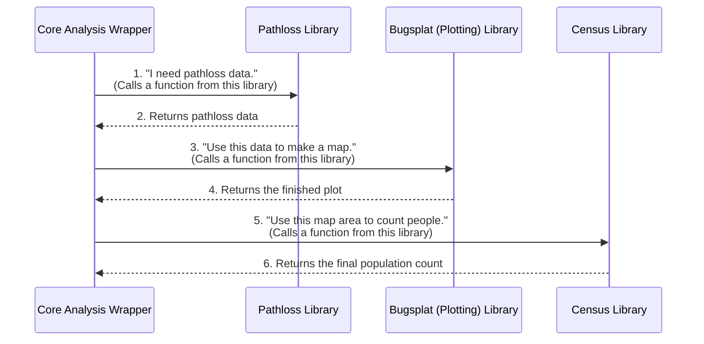

# Chapter 5: Modular Function Libraries

In the last chapter, we met the project's workhorse, the [Core Analysis Wrapper (`wrapper_bugsplat_DSN_EESS_rev15`)](04_core_analysis_wrapper___wrapper_bugsplat_dsn_eess_rev15___.md). We learned to think of it as a specialized engine or a master mechanic that takes our instructions and performs a complex job.

But a good mechanic doesn't build every tool from scratch for every job. They have a well-organized tool chest with drawers for wrenches, screwdrivers, and diagnostic scanners. Our project's code is organized in the exact same way.

## The Problem: The Single, Gigantic, Messy Script

Imagine trying to write our entire analysis—data loading, pathloss calculations, population analysis, plotting—all inside one single `.m` file. It might look something like this:

```matlab
% A nightmare script that does everything in one file
% --- Start of Script ---

% ... 500 lines of code to calculate pathloss ...

% ... 300 lines of code to find affected population ...

% ... 400 lines of code to set up a map ...

% ... 600 lines of code to draw contours and labels on the map ...

% --- End of Script ---
```

This is a terrible idea!
*   **It's impossible to read:** How would you ever find the specific line of code that controls the plot color?
*   **It's hard to maintain:** Fixing a bug in one section could accidentally break something completely unrelated.
*   **It's not reusable:** What if you wanted to use your cool population-counting code in another project? You'd have to copy-paste a huge chunk of code and hope you got all the right pieces.

## The Solution: A Well-Organized Tool Chest

This project avoids that mess by using **Modular Function Libraries**. The code is broken down into separate, specialized folders. Each folder is like a drawer in a mechanic's tool chest, containing a set of tools (functions) for a specific task.

For example, this project has several "drawers":
*   `Generic_Bugsplat/`: A drawer full of tools for creating our "bugsplat" contour maps.
*   `Census_Functions/`: A drawer with tools for analyzing US Census data to find the population in an area.
*   `General_Terrestrial_Pathloss/`: A drawer with highly specialized tools for calculating how radio signals travel over terrain.

This modular design makes the codebase clean, easy to navigate, and incredibly powerful.

## Telling MATLAB Where the Tools Are: `addpath`

Your tool chest is in the garage, but you're working in the driveway. How do you get your tools? You have to go to the garage and bring them to your workspace.

Similarly, we need to tell MATLAB where to find our library folders. We do this at the very beginning of our [Analysis Pipeline Controller](02_analysis_pipeline_controller_.md) script (`init_pull...m`) using the `addpath` command.

```matlab
% Tell MATLAB where to find our toolkits

% Add the path for basic plotting functions
addpath('...\Generic_Bugsplat');

% Add the path for population analysis functions
addpath('...\Census_Functions');

% Add the path for pathloss models
addpath('...\General_Terrestrial_Pathloss');
```
*Note: `...` is used to shorten the file paths for clarity.*

Each `addpath()` command tells MATLAB: "Hey, please add this folder to your list of places to search for functions." Once you've done this, you can call any function from any of those folders as if it were right next to your main script.

## Under the Hood: The Wrapper as the Master Mechanic

Now we can understand the true role of the [Core Analysis Wrapper (`wrapper_bugsplat_DSN_EESS_rev15`)](04_core_analysis_wrapper___wrapper_bugsplat_dsn_eess_rev15___.md). It doesn't actually contain the code to perform these complex tasks. Instead, it acts as the master mechanic, reaching into the correct drawer (library) to grab the right tool (function) at the right time.

This workflow looks like this:



The wrapper's code becomes much cleaner and easier to read because it's just a series of calls to these specialized tools.

Here is a simplified, conceptual example of what the code **inside the wrapper** might look like.

```matlab
% This is a simplified example of code INSIDE the wrapper function

% 1. Reach into the Pathloss toolbox and get the 'calculate_pathloss' tool
pathloss_data = calculate_pathloss(transmitter, receiver_grid);

% 2. Reach into the Bugsplat toolbox and get the 'plot_contour' tool
plot_contour(pathloss_data, plot_title);

% 3. Reach into the Census toolbox and get the 'count_population' tool
people_affected = count_population(pathloss_data);
```

Look how readable that is! Each line clearly states its purpose. The complicated details of *how* the pathloss is calculated or *how* the population is counted are neatly hidden away inside their respective library functions.

### The Power of Reusability

Imagine you start a brand new project that also needs to analyze population data. Because our `Census_Functions` library is a self-contained module, you can simply copy that entire folder into your new project, add it to the path, and immediately start using those tools. You don't have to rewrite a single line of code!

## Conclusion

In this chapter, we pulled back the curtain on how the project is organized. We learned that:

*   Code is organized into **Modular Function Libraries**, which are like specialized drawers in a tool chest.
*   The `addpath()` command tells MATLAB where to find these tool libraries.
*   This approach keeps the main code clean, makes it easy to maintain, and allows powerful functions to be reused across different projects.
*   The [Core Analysis Wrapper (`wrapper_bugsplat_DSN_EESS_rev15`)](04_core_analysis_wrapper___wrapper_bugsplat_dsn_eess_rev15___.md) acts as a manager, delegating tasks to these specialized library functions.

The functions in these libraries can perform very time-consuming calculations. It would be a huge waste of time to re-run them every time we just want to change a plot's color. In the next chapter, we'll see how our project cleverly solves this problem by saving the results of these calculations for later use.

Next up: [Data Caching](06_data_caching_.md)

---

Generated by [AI Codebase Knowledge Builder](https://github.com/The-Pocket/Tutorial-Codebase-Knowledge)