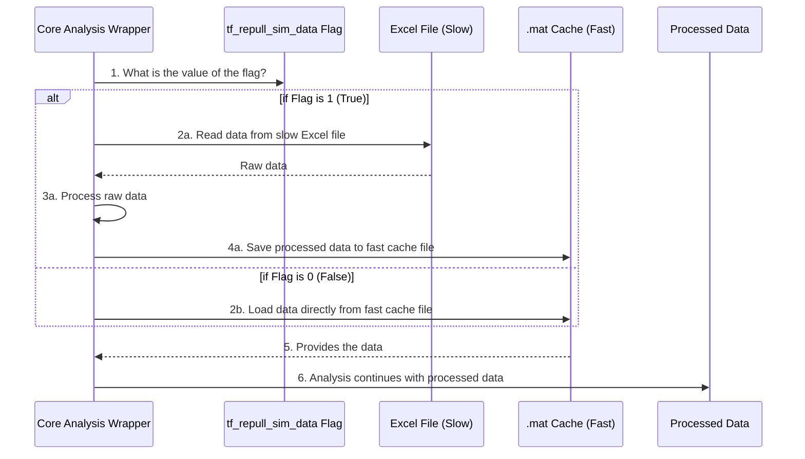

# Chapter 6: Data Caching

In the last chapter on [Modular Function Libraries](05_modular_function_libraries_.md), we saw how our project is neatly organized like a tool chest, with specialized functions for every task. Some of these tasks involve reading large amounts of initial data, for example, from a big Excel spreadsheet.

Imagine you're writing a research paper using a 500-page textbook. The first time, you have to read the entire book carefully to find the key information you need, which takes a long time. But what if you were smart and took detailed notes? The *next* time you need that information, you wouldn't re-read the whole book. You'd just consult your quick, easy-to-read notes. This would save you a huge amount of time.

Our project uses this exact "summary notes" strategy to speed things up, and it's called **Data Caching**.

## The Problem: The Slow, Repetitive Read

One of the first steps in our analysis is to load the simulation data, which is stored in a large Excel file (`.xlsx`). Reading and processing data from Excel can be surprisingly slow, especially if the file is big.

If our script had to read and re-process this slow Excel file every single time we ran it—even if we just wanted to change a plot's color—we would waste a lot of time just waiting for the data to load. This is where caching comes to the rescue.

## The Solution: Creating Fast "Summary Notes"

The idea behind data caching is simple:
1.  **Read Once (The Slow Way):** The very first time we run the analysis, the script reads the data from the slow Excel file.
2.  **Save a Fast Version:** After reading it, the script processes the data into a clean format and saves it as a MATLAB-native `.mat` file. These `.mat` files are incredibly fast for MATLAB to load. This `.mat` file is our "cache"—our summary notes.
3.  **Read Fast Ever After:** On all future runs, the script can skip the slow Excel file and load the data directly from the super-fast `.mat` cache file.

This is all controlled by a simple on/off switch, another one of our [Execution Configuration Flags](03_execution_configuration_flags_.md).

### How to Use the Cache Flag

In our [Analysis Pipeline Controller](02_analysis_pipeline_controller_.md) script (`init_pull...m`), you'll find these lines that set up the caching behavior:

```matlab
% --- Caching Control for Simulation Data ---

% The name of the slow source file
excel_filename_sim_data='Sim_Data_Rev101.xlsx';

% The name of the fast cache file we want to create
mat_filename_sim_data='sim_data_1';

% The on/off switch for caching
tf_repull_sim_data=0; % Set to 1 to re-read from Excel. Set to 0 to use the cache.
```

Let's look at how you'd use `tf_repull_sim_data`:

#### Scenario 1: First Run or Updated Data

If this is your first time running the analysis, or if the source `Sim_Data_Rev101.xlsx` file has been updated with new information, you need to tell the script to re-read it.

You would set the flag to `1`:
```matlab
tf_repull_sim_data=1; % Yes, please re-read the slow Excel file.
```
When you run the script now, it will perform the slow read, process the data, and save it as `sim_data_1.mat` for future use.

#### Scenario 2: All Future Runs

Once the `.mat` cache file has been created, you can save time on all subsequent runs. You don't need to read the Excel file again.

You would set the flag to `0`:
```matlab
tf_repull_sim_data=0; % No, don't read Excel. Load from the fast cache instead.
```
Now, when you run the script, it will almost instantly load the data from `sim_data_1.mat`, potentially saving you minutes of waiting time on every single run!

## Under the Hood: The Program's Decision

How does the script know what to do? The logic is handled inside the [Core Analysis Wrapper (`wrapper_bugsplat_DSN_EESS_rev15`)](04_core_analysis_wrapper___wrapper_bugsplat_dsn_eess_rev15___.md). When the wrapper starts, it looks at the `tf_repull_sim_data` flag you passed to it and makes a simple decision.

This decision process is like coming to a fork in the road:



The diagram shows the two distinct paths. The top path (flag = 1) is the "long road" that you only take once. The bottom path (flag = 0) is the "super-fast highway" you take every other time.

### A Glimpse at the Code's Logic

The code inside the wrapper that implements this is a straightforward `if/else` block. Here's a simplified blueprint of what it looks like:

```matlab
% This is a simplified blueprint of the caching logic INSIDE the wrapper

% Check the flag that the user set in the controller script
if tf_repull_sim_data == 1
    disp('Flag is ON. Reading from slow Excel file...');
    % 1. Read the data from the slow Excel file
    raw_data = readtable(excel_filename_sim_data);
    
    % 2. ... code to process the raw_data ...
    
    % 3. Save the processed data to the fast .mat file for next time
    save(mat_filename_sim_data, 'processed_data');
else
    disp('Flag is OFF. Loading from fast .mat cache...');
    % Just load the variables directly from the saved .mat file
    load(mat_filename_sim_data);
end

% Now the rest of the analysis can use the 'processed_data' variable,
% regardless of where it came from.
```
As you can see, it's a simple but powerful technique. The `if` block does the heavy lifting and saves the results. The `else` block reaps the benefits by taking a massive shortcut.

## Conclusion

Congratulations on completing this tutorial! In this final chapter, we learned about **Data Caching**, a critical performance optimization strategy.

*   We learned that reading data from sources like Excel can be slow.
*   We saw how the project cleverly reads this data once and saves it into a fast-loading MATLAB `.mat` file, which acts as a "cache".
*   We learned how to use the `tf_repull_sim_data` flag to control this behavior, either forcing a fresh read from the source or loading from the fast cache.

This technique, combined with the other concepts we've explored—from the clear [Interference Scenario Definition](01_interference_scenario_definition_.md) to the powerful [Core Analysis Wrapper (`wrapper_bugsplat_DSN_EESS_rev15`)](04_core_analysis_wrapper___wrapper_bugsplat_dsn_eess_rev15___.md) and the organized [Modular Function Libraries](05_modular_function_libraries_.md)—is what makes the `7GHz_plot_DSN_EESS` project a flexible, efficient, and powerful analysis tool.

You now have a solid, high-level understanding of how the entire project is structured and how to control it. Happy analyzing

---

Generated by [AI Codebase Knowledge Builder](https://github.com/The-Pocket/Tutorial-Codebase-Knowledge)