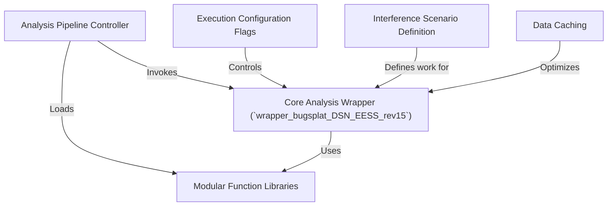

# Tutorial: 7GHz_plot_DSN_EESS

This project is a MATLAB-based tool for analyzing and visualizing potential *radio signal interference*.
It works like a mission control dashboard: a main script acts as a **controller**, setting up all the parameters and on/off *switches* (flags).
This controller then launches a powerful **core analysis function** that calculates and plots interference zones, known as "bugsplats," for different satellite communication systems. The project is built with reusable *modular function libraries* and uses **data caching** to speed up repeated analyses.

**Source Repository:** [None](None)

## Chapters

1. [Interference Scenario Definition
](01_interference_scenario_definition_.md)
2. [Analysis Pipeline Controller
](02_analysis_pipeline_controller_.md)
3. [Execution Configuration Flags
](03_execution_configuration_flags_.md)
4. [Core Analysis Wrapper (`wrapper_bugsplat_DSN_EESS_rev15`)
](04_core_analysis_wrapper___wrapper_bugsplat_dsn_eess_rev15___.md)
5. [Modular Function Libraries
](05_modular_function_libraries_.md)
6. [Data Caching
](06_data_caching_.md)

---

Generated by [AI Codebase Knowledge Builder](https://github.com/The-Pocket/Tutorial-Codebase-Knowledge)