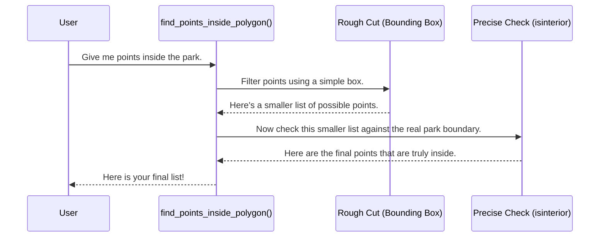

# Chapter 1: Geospatial Operations & Analysis

Welcome to the `Basic_Functions` project! This is the first step on our journey to building powerful location-based analysis tools. In this chapter, we'll explore the heart of our project: the tools that work with geographic data.

Imagine you're a park ranger, and you've just received a list of 1,000 coordinates where a rare flower has been spotted. Your goal is to figure out which of these sightings fall within the boundaries of your national park. Doing this by hand would be impossible! You need a set of digital tools to help. This is exactly what Geospatial Operations & Analysis is all about. It's our digital toolkit for answering questions about "where".

### What Are We Working With? The Basic Shapes

In the world of digital maps, we represent everything with simple shapes. For our project, we care about three main types:

*   **Points**: A single spot on the Earth, defined by its latitude and longitude. Think of a pin on a map. A single flower sighting is a point.
*   **Lines**: A connection between two or more points. Think of a road or a river.
*   **Polygons**: A closed shape that defines an area. Think of the boundary of a country, a lake, or, in our example, a national park.

Our goal is to use these simple shapes to perform powerful analysis.

### Key Tool #1: Point-in-Polygon - Is it inside the area?

The most common question we'll ask is: "Is this point inside this polygon?" This is the core of our park ranger problem. Our project has functions designed to solve this efficiently.

Let's look at how we'd tackle this. We have two sets of data:
1.  `points_latlon`: A list of coordinates for all the flower sightings.
2.  `poly_contour`: A list of coordinates that form the boundary of our national park.

We can use a function like `find_points_inside_polygon` to get our answer.

```matlab
% Input: The park's boundary and the flower coordinates
inside_flower_indices = find_points_inside_polygon(app, park_boundary, flower_coordinates);

% Output: A list of which flowers (by their index number) are inside the park.
% For example: [3, 15, 42, 101, ...]
```

This tells us that flower #3, flower #15, and so on, are inside our protected area. Simple, right? But how does the computer figure this out so fast?

#### Under the Hood: A Two-Step Process for Speed

Checking a point against a complex polygon (like a park boundary with thousands of twists and turns) is slow. If we did this for all 1,000 flower sightings, it could take a long time. So, we use a clever shortcut first.

1.  **The Rough Cut:** We first draw a simple rectangle around our complex park boundary. This is called a "bounding box." Checking if a point is inside a simple rectangle is *extremely* fast.

2.  **The Precise Check:** We throw away all the points that are outside the simple rectangle. For the few points that are left (those inside the box), we then perform the slower, more accurate check against the real park boundary.

This two-step process is a huge time-saver!

Here's a diagram showing the process:



Let's peek at the code in `find_points_inside_polygon.m` that performs this "Rough Cut".

```matlab
% Get the simplest possible box around the polygon
min_lat=min(temp_contour(:,1));
max_lat=max(temp_contour(:,1));
min_lon=min(temp_contour(:,2));
max_lon=max(temp_contour(:,2));
```
This just finds the most northern, southern, eastern, and western points of our park to define the rectangle.

Then, we find all the points that fall within this simple box.

```matlab
% Find points that are inside the simple rectangle
lon_idx1=find(min_lon<points_latlon(:,2));
lon_idx2=find(max_lon>points_latlon(:,2));
cut_lon_idx=intersect(lon_idx1,lon_idx2);
% ... (same for latitude) ...
check_latlon_idx=intersect(cut_lon_idx,cut_lat_idx);
```

Only the points in `check_latlon_idx` move on to the final, precise check, saving us a lot of work!

### Key Tool #2: Buffering - Creating a "Zone of Interest"

Sometimes, we don't just care about a single point, but the area *around* it. For example, maybe we need to create a 1-kilometer "protection zone" around each flower sighting. This is called **buffering**.

The function `calc_sim_bound` helps us do this. It takes a list of points and a radius (e.g., 1 km) and draws a circle around each point.

```matlab
% Input: a list of points and a radius in kilometers
sim_radius_km = 1.0;
base_polygon = [40.7, -74.0; 40.8, -74.1]; % Two points

% Create a 1km buffer around these points
[sim_bound] = calc_sim_bound(app, base_polygon, sim_radius_km);
```

The output, `sim_bound`, would be the coordinates for a larger polygon that encloses both points and their 1km circular buffers.

### Key Tool #3: Convex Hull - The "Rubber Band" Method

Look at the image below. We have many small circles. If we want to find the single, simple shape that contains *all* of them, what would we do?

Imagine all the points making up the circles are nails hammered into a board. If you stretch a single rubber band around the outside of all the nails, the shape it makes is called a **convex hull**.


This is an incredibly useful way to simplify a complex collection of points or shapes into one simple, enclosing polygon.

We use this trick all the time in our code! In the `calc_sim_bound` function, after creating all the little circles, we need to merge them into one big shape. We do this with a convex hull.

Here's the key line from `calc_sim_bound.m`:

```matlab
% Get all the points from all the circles we made
reshape_lat=reshape(temp_lat_buff,[],1);
reshape_lon=reshape(temp_lon_buff,[],1);    

% Find the "rubber band" shape around all of them!
con_hull_idx=convhull(reshape_lon,reshape_lat); 
```
The `convhull` function does the magic. It takes a cloud of points and gives back only the ones that form the outer "rubber band" boundary. This gives us a clean, simple simulation area.

### Summary and What's Next

Congratulations! You've just learned the fundamental concepts of geospatial analysis.

*   We represent real-world locations and areas using **points** and **polygons**.
*   We can efficiently find which points are inside a polygon using a **two-step "rough cut" and "precise check"** method.
*   We can create "zones of interest" around points using **buffering**.
*   We can simplify a complex set of points into a single outline using a **convex hull**.

These tools are the engine of our project, allowing us to perform complex calculations. But calculations are only half the story. The next step is to actually *see* our results on a map!

In the next chapter, we'll learn how to take the polygons and points we've been working with and create beautiful, informative maps.

Ready to see your data come to life? Let's move on to [Chapter 2: Geospatial Visualization](02_geospatial_visualization_.md).

---

Generated by [AI Codebase Knowledge Builder](https://github.com/The-Pocket/Tutorial-Codebase-Knowledge)