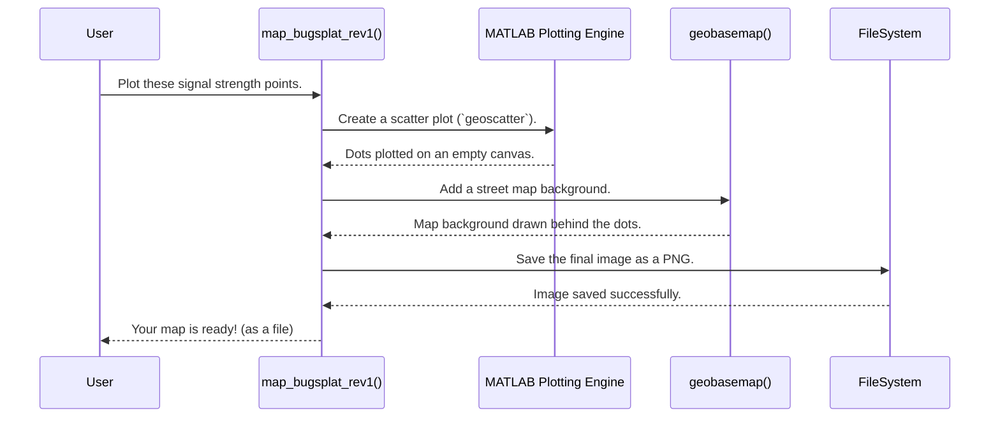

# Chapter 2: Geospatial Visualization

In [Chapter 1: Geospatial Operations & Analysis](01_geospatial_operations___analysis_.md), we learned how to be data detectives. We took raw location data, created shapes like polygons, and asked questions like, "Which of these points are inside our park?" We did the hard work of calculating and analyzing our data.

But numbers and lists of coordinates aren't very exciting, are they? If you give your boss a spreadsheet with 10,000 rows of latitude, longitude, and signal strength values, their eyes will glaze over. We need a way to tell a story with our data. This is where Geospatial Visualization comes in. It's the art of turning our raw, calculated data into insightful, easy-to-understand maps.

### From Numbers to a Story: The Power of a Map

Imagine you've just run a simulation to predict the signal strength of a new radio tower across a city. You now have a giant list of data points.

*   Point 1: 40.7128° N, 74.0060° W, -85 dBm (Strong Signal)
*   Point 2: 40.7580° N, 73.9855° W, -92 dBm (Okay Signal)
*   Point 3: 40.7831° N, 73.9712° W, -105 dBm (Weak Signal)
*   ...and thousands more.

How can you quickly see where the signal is strong and where it's weak? You need a map! Visualization helps us spot patterns, identify problem areas, and communicate our findings in a single glance.

Let's explore the main ways our project does this.

### Technique #1: The "Bugsplat" Plot (Scatter Plot)

The simplest and fastest way to see your data is to create a "bugsplat" plot. The name is a bit silly, but it's memorable! Imagine throwing a paintball at a map for every data point you have—the color of the paintball depends on the signal strength. That's a bugsplat plot.

It's officially called a **scatter plot**, where each point is placed on the map at its latitude and longitude. We then use color to represent its value. For example, bright yellow for strong signals and dark purple for weak signals.

Let's say we have our list of signal strength data in a variable called `signal_data`, where each row is `[latitude, longitude, power]`. We can use our function `map_bugsplat_rev1` to create the map.

```matlab
% Input: A list of points with their power values, a filename, and a title.
signal_data = [40.7, -74.0, -85; 40.8, -74.1, -92; 40.75, -73.9, -105];
output_filename = 'city_signal_map.png';
map_title = 'Signal Strength in Downtown';

map_bugsplat_rev1(app, signal_data, output_filename, map_title);
```

**Output:** This doesn't return a value. Instead, it creates and saves a PNG image file named `city_signal_map.png`. The image would look something like this:


#### Under the Hood: How `map_bugsplat_rev1` Works

Making this plot is surprisingly simple. Here's a peek at the key line in `map_bugsplat_rev1.m`:

```matlab
% Take our lat/lon/power data and create a scatter plot on a map
geoscatter(sort_array_latlonpwr(:,1), ... % The latitudes
           sort_array_latlonpwr(:,2), ... % The longitudes
           10, ...                        % The size of each dot
           sort_array_latlonpwr(:,3), ... % The value that controls the color
           'filled');
```

The magic here is `geoscatter`. It's a MATLAB function that knows how to place dots on a geographic map. We just give it the coordinates, tell it how big the dots should be, and provide the list of power values to determine the color of each dot.

### Technique #2: Contour Lines (Connect-the-Dots for Data)

Bugsplat plots are great, but sometimes they can be messy. If you want to see clear boundaries, like "show me the exact area where signal strength is better than -90 dBm," you need **contour lines**.

Think of a weather map showing temperature. You'll see smooth, curved lines that separate the 70-degree zones from the 80-degree zones. Those are contour lines! They connect all the points that have the same value.

In our project, we can generate these using a function like `map_multi_contours_rev1`.

```matlab
% Input: A list of contour levels. Each item has a power level (e.g., -90)
% and the polygon boundary for that level.
contour_data = {
    -90, [40.7, -74.0; 40.8, -74.0; 40.7, -74.1]; % -90 dBm boundary
    -100, [40.6, -73.9; 40.9, -73.9; 40.6, -74.2]  % -100 dBm boundary
};
output_filename = 'signal_contours.png';
map_title = 'Signal Strength Contours';

map_multi_contours_rev1(app, contour_data, map_title, output_filename);
```

**Output:** This saves a PNG file named `signal_contours.png` that shows clean lines on the map, each representing a specific signal level.

#### Under the Hood: How `map_multi_contours_rev1` Works

Instead of plotting individual dots, this function draws the polygon shapes we calculated back in Chapter 1. The key line in `map_multi_contours_rev1.m` is:

```matlab
% For each contour level...
for i=1:1:num_cirlces
    temp_bound = cell_multi_con{i,2}; % Get the polygon boundary
    % ...
    % Draw the polygon boundary on the map
    geoplot(temp_bound(:,1), temp_bound(:,2), '-', 'LineWidth', 3);
end
```

The `geoplot` function is like `geoscatter`, but instead of drawing dots, it draws lines and shapes. We loop through each of our contour levels and draw its boundary, creating a clean, layered map.

### Technique #3: Shaded Polygons (A Coloring Book for Maps)

Sometimes we don't care about individual points, but about an entire area, like a county or a sales territory. For example: "What percentage of the population in each county has good signal?"

For this, we use **shaded polygons**. We take a pre-defined shape (like a county boundary) and fill it with a single color that represents a value. It's like a coloring book where the color you use for each section depends on your data.

The function `plot_pea_single_zones_rev2_app` does exactly this. It takes a list of market areas (PEAs), a value for each (like percent of population covered), and then colors each one on a national map.



### The Secret Ingredient: A Map Background

A plot of dots or lines on a white background isn't very useful. How do we know if that cluster of weak signal is in a park or a dense urban neighborhood? We need context!

All our plotting functions use one critical command to provide this context:

```matlab
% Add a base map with streets to the plot
geobasemap streets-light
```

This simple line tells MATLAB to fetch a standard map (in this case, a light-colored street map) from a service and place it underneath our data. This instantly makes our plot understandable. There are other options too, like `'satellite'` for a satellite view or `'landcover'` for terrain.

### Summary and What's Next

You've now learned the art of telling a story with data!

*   We turn raw numbers into visual patterns using **geospatial visualization**.
*   **Bugsplat (scatter) plots** are great for a quick overview of point data.
*   **Contour lines** are perfect for showing clear boundaries of value levels.
*   **Shaded polygons** help visualize data that is aggregated over a specific area.
*   The `geobasemap` command is our secret weapon for adding real-world context to every plot.

We can now run analyses and create beautiful maps to show the results. However, running a complex simulation and generating these detailed maps can be very slow. If you click a "Run" button in an application, you don't want the entire program to freeze for ten minutes while it works.

How can we run these long tasks in the background and keep our user interface responsive? That's the challenge we'll tackle in the next chapter.

Get ready to learn about making your applications fast and responsive in [Chapter 3: Parallel Processing & UI Feedback](03_parallel_processing___ui_feedback_.md).

---

Generated by [AI Codebase Knowledge Builder](https://github.com/The-Pocket/Tutorial-Codebase-Knowledge)