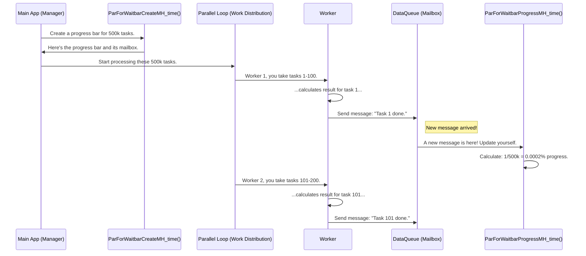

# Chapter 3: Parallel Processing & UI Feedback

In the last two chapters, we learned how to perform complex calculations ([Chapter 1: Geospatial Operations & Analysis](01_geospatial_operations___analysis_.md)) and how to create beautiful maps from the results ([Chapter 2: Geospatial Visualization](02_geospatial_visualization_.md)). But what happens when our analysis involves hundreds of thousands of data points? The calculations could take minutes, or even hours.

If you click "Run" in an application and everything freezes until the work is done, you'd think it crashed. A responsive, user-friendly application needs to do two things:
1.  Work as fast as possible.
2.  Tell the user what's happening while they wait.

This chapter is all about making our application fast and responsive, even during heavy lifting.

### The Problem: A Frozen Application

Imagine you're running a simulation for an entire city. Your computer has to check the signal strength at 500,000 different locations. If your computer's processor checks them one by one, it's like a single person trying to build a skyscraper brick by brick. The application will be completely frozen, unable to be moved, clicked, or closed, until the entire job is finished. This is a terrible user experience.

How can we solve this? We need to hire a team and get a project manager to track their progress.

### The Analogy: The Construction Site

Think of a big, complex task as building a skyscraper.

*   **You (The Main Program):** You are the construction site manager. You have the master blueprint.
*   **The Blueprint:** This is the huge list of 500,000 locations to analyze.
*   **A Single Worker:** A single processor core in your computer. Having one worker is slow.
*   **A Team of Workers:** Modern computers have multiple processor cores. We can hire a "team" of these cores to work at the same time. This is **Parallel Processing**.
*   **The Progress Chart:** A progress bar in your application's user interface (UI). It tells you how close the project is to completion.
*   **Status Updates:** Each worker, upon finishing a part of their job, reports back to the manager, who then updates the main progress chart for everyone to see. This is **UI Feedback**.

Our goal is to use our team of workers efficiently and to provide a clear, constantly updating progress chart.

### Step 1: Hiring Your Team (Starting a Parallel Pool)

Before we can distribute the work, we need to assemble our team. Your computer has a certain number of processor cores (e.g., 4, 8, 16). We can "activate" some of them to create a "pool" of workers ready to accept tasks.

First, we need to know how many workers we can reasonably hire. The function `recommend_num_workers` helps us with this. It checks how many cores your computer has and how much memory is available.

```matlab
% Find out how many workers your computer can support
[workers, max_cores] = recommend_num_workers(app);

% This might tell us: workers = 8, max_cores = 8
```

This function ensures we don't try to hire more workers than our computer can handle. Once we know how many workers we want, we use `start_parpool_poolsize_app` to officially create the team.

```matlab
% Hire 8 workers and get them ready for the job.
parallel_flag = 1; % A switch to turn parallel processing ON
num_workers = 8;
[poolobj, cores] = start_parpool_poolsize_app(app, parallel_flag, num_workers);
```

This command sets up the "parallel pool." Now we have a team of 8 workers waiting for instructions!

### Step 2: The Special Progress Bar (The Manager's Chart)

A normal progress bar won't work here. The manager (your main program) will be busy, and we can't have all 8 workers trying to talk to the manager at once to update the progress. It would be chaos.

Instead, we set up a special communication system. It's like giving our workers a special mailbox.

1.  The manager creates a progress bar and a "mailbox" (called a DataQueue).
2.  The manager tells the progress bar: "Any time a new message appears in this mailbox, run a special function to update yourself."
3.  The workers don't talk to the progress bar directly. They just drop a quick, simple message into the mailbox whenever they finish a task.

The `ParForWaitbarCreateMH_time` function handles this entire setup for us.

```matlab
% Total number of tasks to complete
total_tasks = 500000; 

% Create the progress bar and the special "mailbox" for it.
[hWaitbar, hWaitbarMsgQueue] = ParForWaitbarCreateMH_time('Analyzing Signal...', total_tasks);
```

Now we have a progress bar `hWaitbar` on the screen and a mailbox `hWaitbarMsgQueue` ready to receive updates from our workers.

### Step 3: Distributing the Work and Getting Updates

Now for the magic. We use a special kind of loop in MATLAB called `parfor` (a **par**allel **for**-loop). It looks almost like a normal `for` loop, but it automatically divides the work among all the workers in our pool.

Inside the loop, after a worker finishes one piece of the job, they send a message to the mailbox we created.

```matlab
parfor i = 1:total_tasks
    % --- WORKER'S JOB ---
    % Do one small part of the big calculation.
    % For example, analyze point #i.
    result(i) = calculate_signal_at_point(point_list(i));
    
    % --- REPORTING BACK ---
    % Drop a message in the mailbox to say "I'm done with task i".
    send(hWaitbarMsgQueue, i);
end
```

And that's it! The `parfor` loop handles giving the blueprints to each team. The `send` command lets each team report their progress. The special progress bar we created listens for those `send` messages and updates itself automatically. The user sees a smooth progress bar and the application remains responsive.

### Under the Hood: How It All Connects

Let's visualize the flow of information.



The key is the `DataQueue` (our mailbox). The main app sets up a "listener" on this queue. The code for this is inside `ParForWaitbarCreateMH_time.m`:

```matlab
% Create a mailbox
hWaitbarMsgQueue = parallel.pool.DataQueue;

% Tell the mailbox: "After EACH new item arrives, call this function"
hWaitbarMsgQueue.afterEach(@(x)ParForWaitbarProgressMH_time(...));
```

The `afterEach` function is the magic. It links the mailbox to our progress-updating function, `ParForWaitbarProgressMH_time`.

This update function is also clever. It doesn't just advance the bar; it calculates the elapsed time and estimates the time remaining, giving the user even more useful feedback. Here's a peek inside `ParForWaitbarProgressMH_time.m`:

```matlab
% Get the total work done so far
x = get(h,'UserData'); % UserData stores the count of completed tasks

% Calculate percentage complete
percentage = x / NbrePts; % NbrePts is the total number of tasks

% --- Time calculation logic is here ---
% ... calculates sec_elap and sec_left ...
label_remain = strcat(' - Remaining:',num2str(round(sec_left,0)),' Secs ');

% Update the progress bar's visual and text
waitbar(percentage, h, strcat(Msg, label_remain));
```

By separating the workers from the UI updates with this mailbox system, we allow the heavy computation to happen at full speed in the background without ever freezing the main application.

### Summary and What's Next

You've just learned how to supercharge your application!

*   We can prevent our app from freezing during long tasks by running them in the background.
*   **Parallel Processing** uses a `parfor` loop to divide work among multiple processor cores (workers), making calculations much faster.
*   We use `start_parpool_poolsize_app` to create our "team" of workers.
*   A special progress bar with a **DataQueue (mailbox)** provides real-time **UI Feedback** without slowing down the workers.
*   Workers `send` updates to the mailbox, and the progress bar automatically updates itself.

Now our application is fast and responsive. But what happens if a long simulation is running and the user needs to close the application? Or what if a simulation fails halfway through? We need a way to gracefully manage the state of our simulations—to pause, resume, or know if they completed successfully.

In the next chapter, we'll dive into how to manage the lifecycle of our simulations. Let's move on to [Chapter 4: Simulation Status Management](04_simulation_status_management_.md).

---

Generated by [AI Codebase Knowledge Builder](https://github.com/The-Pocket/Tutorial-Codebase-Knowledge)