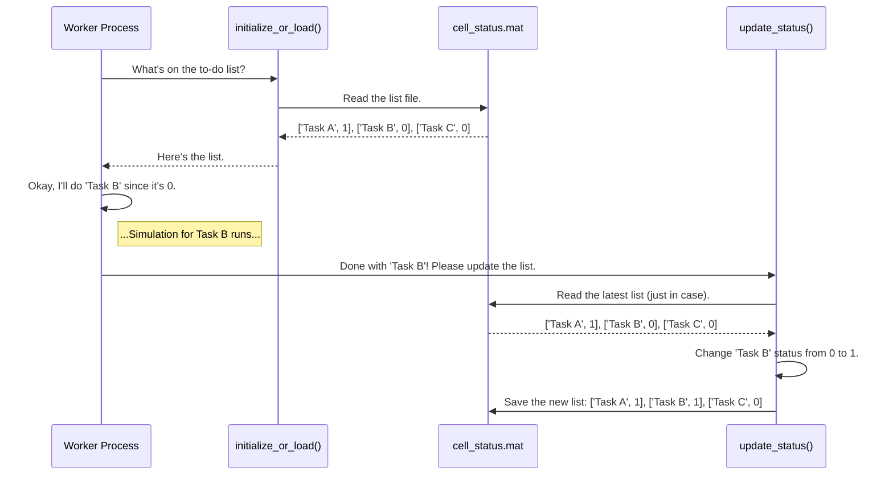

# Chapter 4: Simulation Status Management

In [Chapter 3: Parallel Processing & UI Feedback](03_parallel_processing___ui_feedback_.md), we learned how to build a fast and responsive application that can perform heavy calculations without freezing. We hired a "team" of processor cores to work in parallel and used a special progress bar to keep the user informed.

But what happens when a simulation is so massive it needs to run for days? What if the computer loses power, or you need to shut down the application and resume it tomorrow? Without a memory of what's been done, our team would have to start from scratch every single time. We need a way to track progress that survives restarts.

This is where **Simulation Status Management** comes in. It's the project's long-term memory.

### The Problem: A Forgetful Team of Workers

Imagine you have a huge project: to paint 1,000 different houses (our simulation tasks). You hire 8 painters (our parallel workers) and give them the list of addresses. They get to work.

After a full day, they've painted 200 houses. Everyone goes home. The next morning, they come back to work, but the manager has lost the list of completed houses! The only way to be sure is to start over from the beginning, potentially re-painting the 200 houses they already finished. What a waste of time!

We need a central, shared "to-do list" that everyone can see and update. When a painter finishes a house, they check it off the master list. The next day, the team can just look at the list and see exactly where to pick up.

### The Solution: A Shared To-Do List (`cell_status.mat`)

Our project uses a simple but powerful idea: a single file that acts as this shared to-do list. This file is typically named `cell_status.mat`, and it's the central nervous system for our simulations.

It's just a simple table with two columns:

| Task Name (e.g., Folder Name) | Status (0 or 1) |
| ----------------------------- | --------------- |
| `sim_folder_001`              | 1               |
| `sim_folder_002`              | 1               |
| `sim_folder_003`              | 0               |
| `sim_folder_004`              | 0               |
| ...and 996 more...            | ...             |

*   **Task Name**: A unique name for each small piece of the simulation. In our project, this is usually the name of a subfolder where the task's data and results are stored.
*   **Status**: A simple number to track progress.
    *   **0** means "Pending" or "To-Do".
    *   **1** means "Complete".

By using this file, our application can be stopped and restarted at any time. It will simply read the list, skip the tasks marked with `1`, and resume work on the tasks marked with `0`.

### The Workflow: How a Worker Uses the To-Do List

Every "worker" process in our simulation follows a simple, three-step cycle:

1.  **Check the List**: Before starting, load the `cell_status.mat` file to get the latest to-do list.
2.  **Pick a Task**: Find a task on the list that has a status of `0`.
3.  **Do the Work & Update the List**: Perform the simulation for that one task. Once it's successfully completed, update the status for that task to `1` and save the `cell_status.mat` file.

Let's see how our functions help with this.

#### Step 1 & 2: Creating or Loading the List

The first thing we need is a function that can either create a brand-new to-do list or load an existing one. The function `initialize_or_load_generic_status_rev1` does exactly this.

```matlab
% A list of all the tasks (folder names) we need to complete.
all_tasks = {'sim_folder_001'; 'sim_folder_002'; 'sim_folder_003'};
status_filename = 'cell_status.mat';

% Get the current to-do list.
[to_do_list] = initialize_or_load_generic_status_rev1(app, all_tasks, status_filename);
```
**What happens here?**
*   If `cell_status.mat` **does not exist**, the function creates it. It will have three rows, and every task will have a status of `0`.
*   If `cell_status.mat` **already exists** from a previous run, the function simply loads it into the `to_do_list` variable.

Now, the worker can look at `to_do_list` to find a task with a status of `0`.

#### Step 3: Updating the List After Finishing a Task

Let's say our worker just finished the simulation for `sim_folder_003`. Now it needs to "check it off" the master list. For this, we use the `update_generic_status_cell_rev1` function.

```matlab
% The task we just finished.
finished_task = 'sim_folder_003';
status_filename = 'cell_status.mat';
all_tasks = {'sim_folder_001'; 'sim_folder_002'; 'sim_folder_003'};

% Update the list to mark this task as complete.
update_generic_status_cell_rev1(app, all_tasks, finished_task, status_filename);
```
This function will load `cell_status.mat`, find the row for `sim_folder_003`, change its status from `0` to `1`, and save the file. The next worker that checks the list will see that this task is done and will move on to the next available one.

### Under the Hood: A Day in the Life of a Worker

Let's trace the journey of a single worker process as it interacts with our status management system.



Let's peek at the simplified code that makes this happen.

Inside `initialize_or_load_generic_status_rev1.m`, the logic is straightforward:

```matlab
% Check if the status file already exists
if exist(cell_status_filename, 'file') == 2
    % If it exists, just load it into memory
    load(cell_status_filename, 'cell_status');
else
    % If not, create a new one from scratch
    cell_status = cell(num_folders, 2); % Create empty table
    cell_status(:, 1) = folder_names;   % Add all task names
    cell_status(:, 2) = {0};            % Set ALL statuses to 0 (pending)
    save(cell_status_filename, 'cell_status'); % Save the new list for the first time
end
```
This simple "if/else" check is the key to making our system resumable.

Inside `update_generic_status_cell_rev1.m`, the process is just as logical:

```matlab
% First, load the most current to-do list.
[cell_status] = initialize_or_load_generic_status_rev1(...);

% Find the row number for the task we just completed.
task_row_idx = find(strcmp(cell_status(:, 1), sim_folder) == 1);

% Update the status for that task from 0 to 1.
cell_status{task_row_idx, 2} = 1;

% Save the updated list back to the file. This is the "check-off".
save(cell_status_filename, 'cell_status');
```

You might notice in the actual code that the `save` command is inside a `while` loop. This is a small but important detail. When many workers are trying to update the same file at once, one might try to save while another is still reading it, which can cause errors. The `while` loop tells the function: "Try to save. If it fails, wait a moment and try again." This makes our file operations much more reliable.

### Summary and What's Next

You've just learned how we give our application a persistent memory!

*   We manage large, long-running simulations using a **shared to-do list**, a file called `cell_status.mat`.
*   This file tracks every task and its status: **0 for pending** and **1 for complete**.
*   This allows our application to be **stopped and restarted** without losing progress, making it incredibly resilient.
*   Functions like `initialize_or_load...` get the process started, and `update...` checks items off the list.

Our system is now fast, responsive, and resilient. But as we hinted, having many workers reading and writing to the same files (`cell_status.mat` or other data files) can be tricky. What happens if a file is written incorrectly and becomes corrupted? How do we handle these potential file-related problems gracefully?

In the next chapter, we'll explore the techniques we use to make our file operations bulletproof. Let's move on to [Chapter 5: Robust File I/O & Caching](05_robust_file_i_o___caching_.md).

---

Generated by [AI Codebase Knowledge Builder](https://github.com/The-Pocket/Tutorial-Codebase-Knowledge)