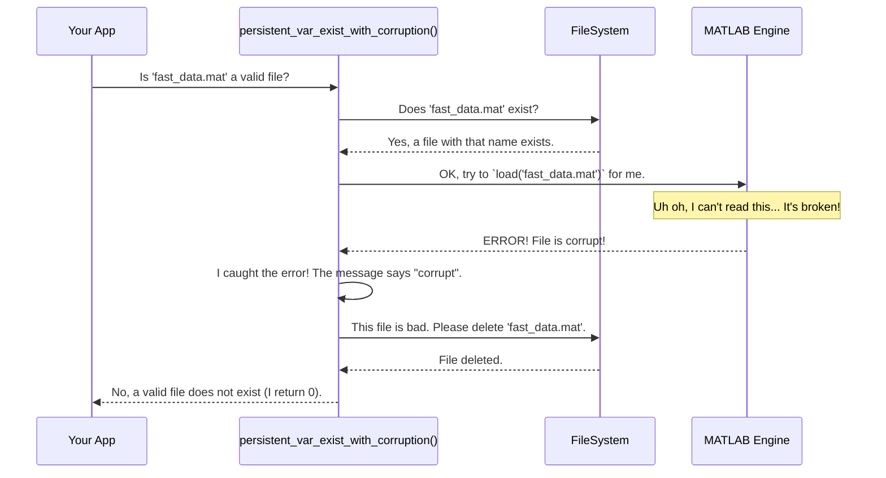

# Chapter 5: Robust File I/O & Caching

In [Chapter 4: Simulation Status Management](04_simulation_status_management_.md), we built a resilient system that can stop and resume massive jobs by keeping a `cell_status.mat` "to-do list". This is fantastic for long-running tasks. Our system saves its work along the way, creating many intermediate data files.

But what happens if one of those saved files gets broken? A power outage, a network hiccup, or two processes writing at the same time can corrupt a file. The next time our program tries to read that broken file, it will crash. We need a way to make our file operations not just resumable, but also "self-healing".

This chapter is about safely and efficiently reading and writing files. We'll learn a critical pattern for handling file corruption automatically, making our application incredibly robust.

### The Problem: The Corrupted Library Book

Imagine our program relies on a central library of data files. One important file is like a reference book that gets used over and over. Let's say we have a function that reads a huge, slow Excel file and saves a fast, pre-processed `.mat` version for future use. This is a form of **caching**: doing the slow work once and saving the result for quick access later.

*   **First time:** Read the slow 100MB Excel file (takes 30 seconds). Save it as `fast_data.mat`.
*   **Next time:** See that `fast_data.mat` exists. Load it instantly (takes 0.1 seconds). Huge time saving!

Now, imagine the program crashes while it's writing `fast_data.mat`. We're left with a half-written, corrupted file. The next time the program runs, it sees `fast_data.mat` exists, tries to load it, and... `ERROR! File might be corrupt.` The entire application grinds to a halt.

It's like finding a library book with half its pages ripped out. You can't use it, and it prevents you from doing your research. What we need is a librarian who, upon finding a damaged book, immediately throws it away and orders a fresh copy.

### The Solution: The Self-Healing File Pattern

Our project uses a simple but powerful "self-healing" pattern for reading files. It's a three-step safety check:

1.  **Check Existence:** Does the file exist?
2.  **Attempt to Load:** If it exists, try to load it. We wrap this attempt in a `try...catch` block, which is like saying, "Try to do this, but if it fails, don't crash. Instead, run this other bit of code."
3.  **Heal on Failure:** If the `catch` block is triggered because of a corruption error, our code immediately **deletes the broken file**.

By deleting the bad file, we force the system to regenerate it the next time it's needed. The damaged library book is gone, and a new one is automatically created from the original source (the slow Excel file).

This combination of saving processed data (**caching**) and automatically cleaning up bad files (**self-healing**) is what we call **Robust File I/O**.

### Our Key Tool: `persistent_var_exist_with_corruption`

This entire self-healing pattern is wrapped up in one convenient function: `persistent_var_exist_with_corruption`. You don't ask it, "Does this file exist?". You ask it, "Does a **good, usable** copy of this file exist?"

Let's see how we use it to safely load our cached data. The code in `load_full_excel_rev1.m` follows this exact logic.

```matlab
% We want to load data from this .mat file if it's available
mat_filename_str = 'fast_data.mat';
excel_filename = 'slow_data.xlsx';

% Ask our special function if a GOOD copy exists.
var_exist = persistent_var_exist_with_corruption(app, mat_filename_str);

if var_exist == 2 % Code '2' means "Yes, a good file exists!"
    % It's safe to load!
    load(mat_filename_str, 'cell_data');
else
    % File doesn't exist, or it was corrupt and got deleted.
    % We do the slow work now.
    cell_data = readcell(excel_filename);
    % ...and save a fresh, good copy for next time.
    save(mat_filename_str, 'cell_data');
end
```
This simple `if/else` block is the heart of our robust caching system. It guarantees we either load a valid file or safely regenerate it, but we never crash because of a corrupt one.

### Under the Hood: A Look Inside the Healing Process

So what exactly does `persistent_var_exist_with_corruption` do when you call it? Let's follow the logic.



The code that implements this logic inside `persistent_var_exist_with_corruption.m` is surprisingly straightforward.

First, it does a basic check to see if any file with that name exists.

```matlab
% file_name is the input, like 'fast_data.mat'
var_exist = exist(file_name, 'file');
% If the file exists, var_exist will be 2. If not, it's 0.
```

If the file *does* exist, it then proceeds to the crucial `try...catch` safety check.

```matlab
% This block only runs if a file was found (var_exist == 2)
if var_exist == 2
    try
        % --- THE ATTEMPT ---
        % Try to load the file. If it's healthy, this line works
        % and the 'catch' block is skipped.
        load(file_name);

    catch error_msg
        % --- THE REACTION ---
        % If loading failed, we land here instead of crashing.
        % 'error_msg' contains details about what went wrong.
        % Now we check if it was a corruption error.
    end
end
```

Finally, inside the `catch` block, it inspects the error message. If it looks like a corruption error, it performs the cleanup.

```matlab
% Get the text of the error message
temp_error_string = error_msg.message;

% Check for keywords that signal a corrupt file
tf_find1 = contains(temp_error_string, 'File might be corrupt.');
tf_find2 = contains(temp_error_string, 'Cannot read file');

if tf_find1 == 1 || tf_find2 == 1
    % It's a corruption error! Delete the bad file.
    delete(file_name);
    
    % Report back that the file is no longer there.
    var_exist = 0;
end
```
And that's the "magic"! By checking the error message and deleting the file, the function ensures that your main application code will never have to deal with a broken file.

### Summary and What's Next

You've now learned how to make your application's file handling bulletproof.

*   We use **caching** (saving processed results) to make our application faster on subsequent runs.
*   We handle the risk of file corruption with a **self-healing** pattern: **try to load, catch the error, and delete the bad file**.
*   The `persistent_var_exist_with_corruption` function wraps this entire logic, allowing us to safely check for "good, usable" files.

Our application is now fast, responsive, resilient, and robust. But there's one more challenge when working in a parallel environment. We've solved the problem of reading a file that *another worker* might have corrupted. But what stops two workers from trying to *write to the same file at the exact same time*, corrupting it in the first place?

To solve this, we need a traffic-control system for file access. In the next chapter, we'll learn how to implement this using a simple but effective file-based locking mechanism.

Let's proceed to the final chapter: [Chapter 6: Concurrency Control (File-based Locking)](06_concurrency_control__file_based_locking__.md).

---

Generated by [AI Codebase Knowledge Builder](https://github.com/The-Pocket/Tutorial-Codebase-Knowledge)