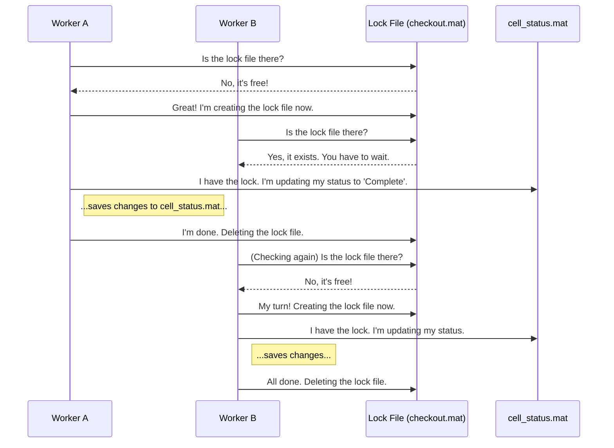

# Chapter 6: Concurrency Control (File-based Locking)

In [Chapter 5: Robust File I/O & Caching](05_robust_file_i_o___caching_.md), we learned how to build a "self-healing" system that can automatically detect and fix corrupted files. This makes our application robust when *reading* data. But what about *writing* data?

What happens when multiple workers from our parallel processing team try to update the same critical file, like our shared to-do list from [Chapter 4: Simulation Status Management](04_simulation_status_management_.md), at the exact same moment? The result is chaos and, almost certainly, a corrupted file. We need a traffic cop to make sure only one worker can modify a shared file at a time. This is called **Concurrency Control**.

### The Problem: Two People in a One-Person Restroom

Imagine a busy train station with a single-person restroom. If there's no lock on the door, two people might try to enter at the same time, leading to a very awkward situation. The solution is simple: a lock. The first person to arrive locks the door, putting up an "Occupied" sign. Anyone else who arrives must wait until the first person is finished and unlocks the door.

In our software, the shared to-do list, `cell_status.mat`, is our single-person restroom. Our parallel workers are the people who need to use it. If two workers try to write to `cell_status.mat` simultaneously, they will overwrite each other's changes, and the file will end up broken (corrupted). This is a classic computer science problem called a **race condition**.

We need to give our workers a way to "lock the door".

### The Solution: A Simple "Occupied" Sign (`checkout.mat`)

Our project implements a simple and effective locking mechanism using a temporary file. This "lock file," often called `checkout.mat`, acts as our "Occupied" sign.

Here's how the process works for any worker that needs to update `cell_status.mat`:

1.  **Check the Lock:** The worker first checks if a file named `checkout.mat` exists.
2.  **Wait if Occupied:** If the file exists, it means another worker is currently using `cell_status.mat`. The worker must wait patiently. It will keep checking every fraction of a second until `checkout.mat` is gone.
3.  **Lock the Door:** As soon as the worker sees that `checkout.mat` has been deleted, it knows the "restroom" is free. It immediately **creates its own `checkout.mat` file**. This is like locking the door behind you. Now, any other workers who come along will see the new lock file and start waiting.
4.  **Do the Work:** With the door safely locked, the worker can now read `cell_status.mat`, update its own task from "Pending" to "Complete", and save the changes.
5.  **Unlock the Door:** Once the worker has successfully saved `cell_status.mat`, its final step is to **delete the `checkout.mat` file**. This unlocks the door, signaling to the next waiting worker that it's their turn.

This simple but powerful system ensures that file updates happen one at a time, in an orderly fashion, preventing race conditions and data corruption.

### The All-in-One Function: `checkout_cell_status_rev1`

This entire check-wait-lock-work-unlock process is managed by a single function: `checkout_cell_status_rev1`. When a worker finishes its simulation task, it calls this function to safely report its completion.

```matlab
% --- Inside a worker's code, after finishing its simulation ---

% The lock file we will use as our "occupied" sign.
checkout_filename = 'checkout.mat';

% The shared to-do list we need to update.
status_filename = 'cell_status.mat';

% The name of the task this worker just finished.
my_completed_task = 'sim_folder_042';

% Safely update the shared list. This function handles all the locking.
checkout_cell_status_rev1(app, checkout_filename, status_filename, my_completed_task, ...);
```
When this function is called, it will not return until it has successfully and safely updated `cell_status.mat`. Your worker process doesn't need to worry about the details; it just knows the job will get done correctly.

### Under the Hood: A Day at the Train Station

Let's watch two of our workers, Worker A and Worker B, as they both finish their tasks at roughly the same time and try to update the shared list.



This sequence guarantees that Worker B's update doesn't interfere with Worker A's.

Let's peek at the simplified code inside `checkout_cell_status_rev1.m` that makes this happen.

**Step 1 & 2: Waiting for the Lock**

The function enters a `while` loop, which is the "waiting room." It won't exit this loop until the `checkout.mat` file is gone.

```matlab
% This loop is the waiting room.
retry_tf_checkout = 1;
while(retry_tf_checkout == 1)
    
    % Check if the "occupied" sign (the lock file) exists.
    tf_checkout = exist(checkout_filename, 'file');
    
    if tf_checkout == 0
        % It's free! Exit the waiting room.
        retry_tf_checkout = 0;
    else
        % It's occupied. Wait a moment, then the loop will check again.
        pause(0.2); 
    end
end
```

**Step 3: Locking the Door**

As soon as the waiting loop finishes, the first thing the function does is create its *own* lock file to claim the resource.

```matlab
% Create a dummy variable to save
checkout = 1; 

% Save the variable to a file, creating our lock.
% Now any other worker will be stuck in the waiting room.
retry_save = 1;
while(retry_save == 1)
    try
        save(checkout_filename, 'checkout');
        retry_save = 0;
    catch
        retry_save = 1; % Try again if saving fails (e.g., network issue)
    end
end
```

**Step 4 & 5: Do the Work and Unlock**

Now, with exclusive access, the function can safely modify `cell_status.mat` and then, finally, remove the lock.

```matlab
% --- Safely update cell_status.mat ---
% ... (Code to load, find the right row, change 0 to 1, and save) ...

% --- Unlock the door ---
% The work is done. Delete the lock file so someone else can go.
tf_delete = 1;
while(tf_delete == 1)
    try
        delete(checkout_filename);
        tf_delete = 0;
    catch
        tf_delete = 1; % Try again if deleting fails
    end
end
```
The many `while` loops and `try...catch` blocks you see in the real code are there to make the process extra safe, especially when working on slow or unreliable network drives. They ensure that an operation is retried until it succeeds.

### Conclusion: Our Journey is Complete!

Congratulations! You've reached the end of the `Basic_Functions` tutorial. You've followed the entire lifecycle of a complex data analysis project.

Let's recap the journey:
*   In [Chapter 1: Geospatial Operations & Analysis](01_geospatial_operations___analysis_.md), we learned the building blocks of working with location data.
*   In [Chapter 2: Geospatial Visualization](02_geospatial_visualization_.md), we turned that raw data into insightful and beautiful maps.
*   In [Chapter 3: Parallel Processing & UI Feedback](03_parallel_processing___ui_feedback_.md), we made our application fast and responsive by running huge jobs in parallel.
*   In [Chapter 4: Simulation Status Management](04_simulation_status_management_.md), we made our application resilient, allowing it to be stopped and resumed without losing work.
*   In [Chapter 5: Robust File I/O & Caching](05_robust_file_i_o___caching_.md), we made it robust by teaching it to heal itself from corrupted files.
*   And finally, in this chapter, we ensured data integrity in a parallel world using **file-based locking**.

You now understand the core principles that make the `Basic_Functions` project a powerful, fast, and reliable tool for geospatial analysis. You have the foundation you need to explore the code, understand how it works, and even extend it to solve your own unique problems. Happy coding

---

Generated by [AI Codebase Knowledge Builder](https://github.com/The-Pocket/Tutorial-Codebase-Knowledge)