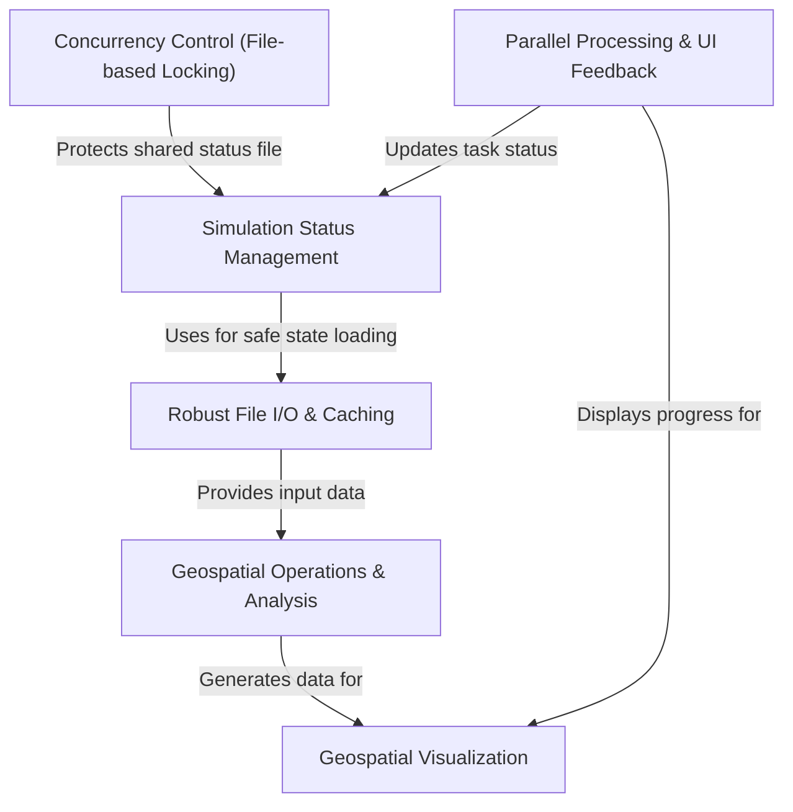

# Tutorial: Basic_Functions

This project is a powerful tool for running large-scale *geospatial simulations*, such as modeling wireless signal coverage. It is built to be **highly efficient** by running calculations in *parallel* on multiple processor cores. A key feature is its **robust status tracking**, which allows long simulations to be paused and resumed without losing work. Finally, it turns complex numerical results into easy-to-understand **visual maps**.

**Source Repository:** [Basic_Functions](https://github.com/nicklasorte/Basic_Functions)

## Chapters

1. [Geospatial Operations & Analysis
](01_geospatial_operations___analysis_.md)
2. [Geospatial Visualization
](02_geospatial_visualization_.md)
3. [Parallel Processing & UI Feedback
](03_parallel_processing___ui_feedback_.md)
4. [Simulation Status Management
](04_simulation_status_management_.md)
5. [Robust File I/O & Caching
](05_robust_file_i_o___caching_.md)
6. [Concurrency Control (File-based Locking)
](06_concurrency_control__file_based_locking__.md)

---

Generated by [AI Codebase Knowledge Builder](https://github.com/The-Pocket/Tutorial-Codebase-Knowledge)
