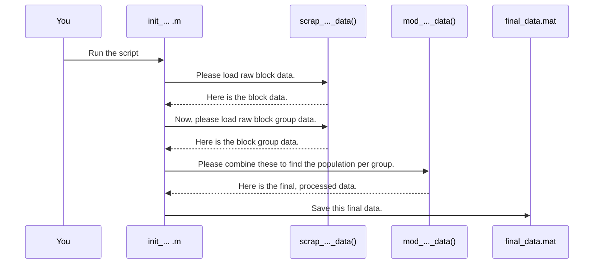

# Chapter 1: Workflow Orchestration Scripts

Welcome to the `Census_Data_Processing` project! If you're new here, you're in the perfect place to start. This project is all about taking raw, complex data from the US Census Bureau and turning it into something clean, useful, and ready for analysis.

But where do you begin in a project with so many files and functions? The answer is with a **Workflow Orchestration Script**.

### The Head Chef in a Busy Kitchen

Imagine you're trying to cook a complex meal with many ingredients and steps. You wouldn't just start grabbing things randomly. You'd follow a **recipe**. The recipe tells you what to do and in what order: chop the vegetables, preheat the oven, mix the ingredients, and finally, bake the dish.

In our project, the **Workflow Orchestration Scripts** are our recipes. They are the main scripts that control the entire data processing pipeline from start to finish. Think of them as a head chef directing the entire kitchen.

These scripts, which are always named starting with `init_` (like `init_create_2020_census_pop_data_rev5.m`), don't do all the little tasks themselves. Instead, they call on specialized "assistant" functions to do the heavy lifting, just like a head chef tells their team to handle specific jobs.

By reading one of these `init_*.m` files, you can see the entire plan at a glance:
1.  **Prepare Ingredients**: Load raw data from shapefiles.
2.  **Process**: Clean up and combine the data.
3.  **Final Dish**: Save the processed, useful data into `.mat` files.

### Our Goal: A Simple "Recipe" for Population Data

Let's look at a common goal for this project: to calculate the total population for different census regions (like "block groups") using the most detailed data available ("census blocks").

Our "recipe" needs to follow these steps:
1.  **Load** the census block data, which contains population counts for tiny areas.
2.  **Load** the census block group data, which defines larger geographic boundaries.
3.  **Combine** them by adding up the populations of all the blocks that fall within each block group.
4.  **Save** this final, aggregated population data.

Let's see how an orchestration script handles this.

### A Walkthrough of an Orchestration Script

We'll look at a simplified version of a real script from this project, `init_scrap_2023_census_pop_data_rev5.m`. Don't worry about understanding every single line; focus on the sequence of commands.

#### Step 1: Setting the Table (Initialization)

Every recipe starts with some preparation. Here, we clear old variables and tell MATLAB where to find our "assistant" functions.

```matlab
% Clear the workspace and command window
clear;
clc;

% Add our code folders to the MATLAB path
folder1 = 'C:\...\Census_Functions';
addpath(folder1);
addpath('C:\...\Basic_Functions');
```
This is standard setup. It ensures we have a clean slate and access to all our tools before we start cooking.

#### Step 2: Gathering the Ingredients (Loading Data)

Now, the script calls a helper function to get our first ingredient: census block data. This is the most detailed level, containing individual population counts.

```matlab
% --- Load Census Block Data ---
top_census_folder = 'C:\Local Matlab Data\Census_Blocks_2023';

% This helper function reads the raw shapefiles.
% We'll explore it in Chapter 2.
[cell_block_data] = scrap_multi_folder_census_array_data_rev1(...);
```
Here, the orchestration script delegates the messy task of file reading to a helper function. We'll learn all about how that function works in [Chapter 2: Shapefile Data Extraction](02_shapefile_data_extraction_.md). For now, just know that `cell_block_data` now holds our population data.

Next, it gets the data for the larger regions, the "block groups."

```matlab
% --- Load Census Block Group Data ---
top_census_folder_groups = 'C:\Local Matlab Data\Census_Block_Group_2023';

% We use a similar helper to get the block group information.
[cell_block_group_data] = scrap_multi_folder_census_array_data_rev1(...);
```
Now we have our two main ingredients ready: the detailed block data and the block group boundaries.

#### Step 3: Cooking the Dish (Processing and Aggregation)

This is the most important part of the recipe. The script calls another powerful helper function to combine our ingredients. This function adds up the population from the small blocks to get a total for each larger block group.

```matlab
% --- Combine and Process the Data ---
% This function does the heavy lifting of matching blocks to their groups
% and summing the population. We'll dive into this in Chapter 4!

[mod_cell_block_group_data] = mod_block_group_data_rev1(...
    cell_block_data, cell_block_group_data, ...); % other inputs...
```
This is the magic! All the complex logic for combining data is handled by `mod_block_group_data_rev1`. You'll learn the secrets behind this in [Chapter 4: Hierarchical Data Aggregation](04_hierarchical_data_aggregation_.md).

#### Step 4: Serving the Plate (Saving the Result)

Finally, after all the processing, the script saves the final, clean result to a `.mat` file. This file is easy to load for future analysis, so we don't have to run the whole recipe every time.

```matlab
% --- Save the Final Product ---
% We save our final data into a .mat file for easy access later.
% This is a form of caching, which we discuss in Chapter 6.

save('Cascade_new_full_census_2020.mat', 'new_full_census_2020');
```
This saving step is a simple but crucial part of our workflow. It's an example of caching, a concept we will fully explore in [Chapter 6: Caching with Corruption Handling](06_caching_with_corruption_handling_.md).

### How It Works: A Look Under the Hood

The orchestration script acts as a manager. It knows the goal and the steps required, but it delegates the actual work.

Here is a diagram showing the flow of commands when you run an `init_*.m` script:



This "manager and assistants" pattern makes the code:
*   **Easy to Read**: The main script shows the high-level plan, not thousands of lines of messy details.
*   **Modular**: Each assistant (helper function) has one job. If we need to fix how we read files, we only need to look at the `Extractor` function.
*   **Reusable**: We can write a new "recipe" (another `init_*.m` script) that uses the same `Extractor` or `Aggregator` for a different purpose.

### Conclusion

You've now seen the big picture! The **Workflow Orchestration Scripts** (`init_*.m`) are the starting point for understanding this project. They act as master recipes, showing you the step-by-step process of turning raw data into a finished product by calling a series of helper functions.

Now that you understand the overall flow, are you ready to look at our first "assistant"? In the next chapter, we will dive into the first step of our recipe: getting the raw data from the original Census files.

Next up: [Chapter 2: Shapefile Data Extraction](02_shapefile_data_extraction_.md)

---

Generated by [AI Codebase Knowledge Builder](https://github.com/The-Pocket/Tutorial-Codebase-Knowledge)