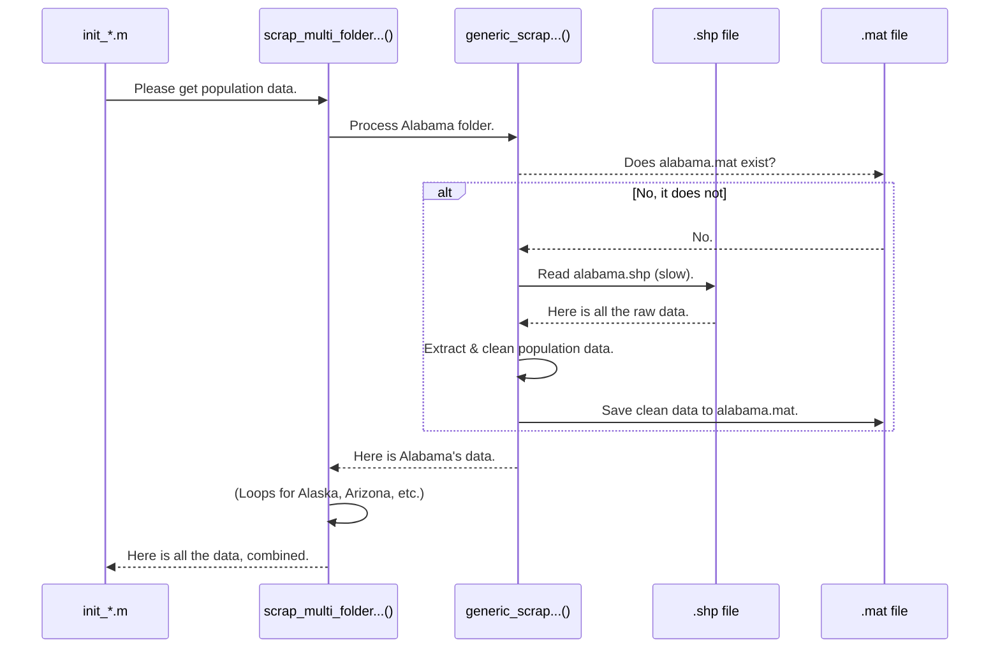

# Chapter 2: Shapefile Data Extraction

In [Chapter 1: Workflow Orchestration Scripts](01_workflow_orchestration_scripts_.md), we learned that our `init_*.m` scripts are like a head chef following a recipe. The first step in any recipe is to gather the ingredients. For us, the raw ingredients are buried inside complex files provided by the US Census Bureau called **shapefiles**.

This chapter is all about our first "assistant chef," the one whose only job is to get those ingredients ready.

### The Specialized Librarian for Map Books

Imagine the US Census data is a massive, multi-volume encyclopedia. Each volume (one for each state) is a **shapefile** (`.shp`). A shapefile isn't just a simple text file; it's a special kind of digital map book. It contains:
*   **Geographic Shapes**: The exact coordinates (latitude and longitude) that draw the boundaries of a census block, like a detailed coloring book page.
*   **Attribute Data**: A huge table of information for each shape, like its name, population, land area, and hundreds of other statistics.

Reading these "map books" can be slow and complicated. If we only need the population count for each area, why would we read the entire book, including all the boundary coordinates and 500 other statistics, every single time? We wouldn't!

This is where our **Shapefile Data Extraction** functions come in. Think of them as a specialized librarian. You give the librarian a list of what you need (e.g., "Population" and "Land Area" for California), and they go to the correct volume, find the exact information, write it down on a neat little notecard for you, and file that notecard away for quick access later.

Our extraction functions do exactly this:
1.  Read a raw `.shp` file once.
2.  Pull out *only* the specific columns of data we ask for.
3.  Convert any text-based numbers into actual numbers.
4.  Save this small, clean, and useful data into a MATLAB `.mat` file (our "notecard").

This `.mat` file is incredibly fast to load, so we only have to do the slow "librarian" work once.

### The Two-Level Approach: Manager and Worker

The Census Bureau gives us data in separate folders, usually one for each state. To handle this, our project uses a clever two-level system:

1.  **The "Multi-Folder" Wrapper (The Manager):** This function, like `scrap_multi_folder_census_array_data_rev1.m`, manages the process for all 50+ state folders. Its job is to loop through each folder and tell a "worker" function to process it.
2.  **The "Generic" Extractor (The Worker):** This function, like `generic_scrap_census_array_data_rev1.m`, does the actual work for a *single* shapefile. It's our librarian who reads one book at a time.

Let's see how they work together.

### A Walkthrough: Extracting Population Data

Our goal is to get the population for every census block in the country. The `init_*.m` script calls our "manager" function to start the process.

```matlab
% These are the only columns we want from the shapefile
columns_to_keep = {'GEOID20', 'P1_001N', 'ALAND20'}; % ID, Population, Land Area

% Call the manager to process all state folders
[cell_block_data] = scrap_multi_folder_census_array_data_rev1(...
    'C:\...\Census_Blocks_2023', ... % The folder containing all state folders
    columns_to_keep, ...
    ... % other inputs
);
```

The `scrap_multi_folder_...` function now takes over. It looks inside the `Census_Blocks_2023` folder and sees sub-folders like `tl_2023_01_tabblock20` (for Alabama), `tl_2023_02_tabblock20` (for Alaska), and so on.

For each state folder, it calls the "worker" function, `generic_scrap_census_array_data_rev1`, to do the heavy lifting. Let's look inside that worker function.

#### Under the Hood: The "Worker" Extractor

Here's a step-by-step look at what `generic_scrap_census_array_data_rev1.m` does for a single state, like Alabama.

**Step 1: Find the Shapefile**
First, it finds the actual `.shp` file inside the state's folder.

```matlab
% Look for any file ending in .shp
folder_info = dir(shape_folder);
% ... logic to find the .shp filename ...
shape_file_label = 'tl_2023_01_tabblock20.shp'; % The file for Alabama
```

**Step 2: Check for a "Notecard" (`.mat` file)**
Before doing any hard work, it checks if we've already processed this file. Has our librarian already made a notecard? If a clean `.mat` file exists, it just loads that and is done in a fraction of a second! This is a core part of our [Caching with Corruption Handling](06_caching_with_corruption_handling_.md) strategy.

```matlab
% Has this file already been processed and saved as a .mat file?
filename_array_shape_mat = 'block_data_array_tl_2023_01_tabblock20.mat';

if exist(filename_array_shape_mat, 'file') == 2
    % Yes! Just load the fast .mat file.
    load(filename_array_shape_mat, 'array_census_data');
    return; % Job done!
end
```

**Step 3: Read the Raw Shapefile (if no `.mat` exists)**
If no `.mat` file is found, it's time for the slow part. It reads the entire `.shp` file. This can take several seconds.

```matlab
% Okay, no .mat file found. We have to read the raw .shp file.
temp_shapefile = shaperead(shape_file_label);
```
The result, `temp_shapefile`, is a huge structure containing *all* the data—dozens of columns and complex boundary coordinates.

**Step 4: Find and Extract Only What We Need**
Now, the function acts like a filter. It finds the specific columns we asked for (`'GEOID20'`, `'P1_001N'`, `'ALAND20'`) and ignores everything else.

```matlab
% Get the names of all columns in the shapefile
all_column_names = fieldnames(temp_shapefile);

% Find the index of the columns we want to keep
% ... logic to match 'GEOID20', 'P1_001N', etc. ...

% Extract only the data from those columns
temp_cell_data = shape_cell(keep_indices, :)';
```

**Step 5: Clean the Data**
Often, numbers in shapefiles are stored as text (e.g., `'123'` instead of `123`). This step converts them into real numbers so we can do math with them later.

```matlab
% Population is often text, so convert it to a number
population_as_numbers = str2double(temp_cell_data(:, 2));

% Create a final, clean array with just the data we need
array_census_data = [geoid_as_numbers, population_as_numbers, ...];
```

**Step 6: Save the "Notecard" for Next Time**
Finally, it saves the small, clean `array_census_data` into a `.mat` file. The next time we run our script, it will find this file in Step 2 and skip all the slow work!

```matlab
% Save our clean data to a .mat file for fast loading in the future
save(filename_array_shape_mat, 'array_census_data');
```

This entire process is visualized below.



### Two Flavors of Extraction: Attributes and Boundaries

Our librarian is skilled in two ways. So far, we've seen how they extract **attribute data** (like population and area) into simple numeric arrays.

But sometimes, we need the **geographic boundaries**—the actual `X` and `Y` coordinates that draw the map. For this, we use a slightly different "worker" function, `generic_scrap_census_contour_rev1.m`. This function extracts the boundary data and saves it in a format perfect for mapping. We will see this data in action when we get to [Chapter 5: Geospatial "Point-in-Polygon" Analysis](05_geospatial__point_in_polygon__analysis_.md).

### Conclusion

You've now met our "librarian"! The **Shapefile Data Extraction** functions are essential assistants in our data processing kitchen. They take raw, messy, and slow-to-read shapefiles and turn them into clean, fast, and ready-to-use ingredients (`.mat` files). They do this by:
*   Managing extraction across dozens of state-level folders.
*   Reading a shapefile only once.
*   Filtering for just the columns we need.
*   Saving the result in a fast `.mat` cache for future use.

Now that we've extracted all this data on a state-by-state basis, how is it organized? In the next chapter, we'll look at the simple but powerful way our project structures this data.

Next up: [Chapter 3: State-Segregated Data Structure](03_state_segregated_data_structure_.md)

---

Generated by [AI Codebase Knowledge Builder](https://github.com/The-Pocket/Tutorial-Codebase-Knowledge)