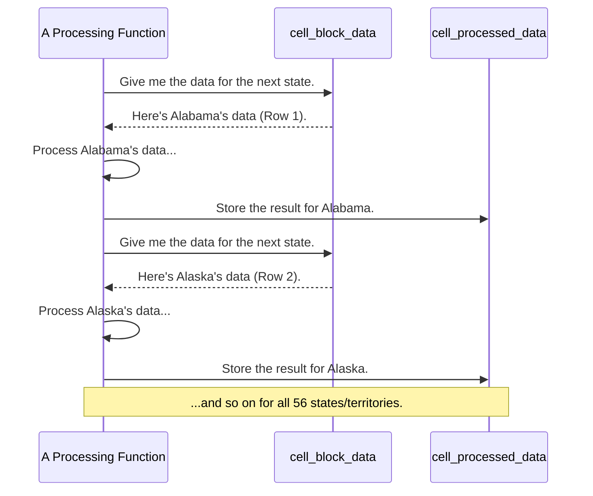

# Chapter 3: State-Segregated Data Structure

In [Chapter 2: Shapefile Data Extraction](02_shapefile_data_extraction_.md), we learned how our "librarian" functions pull clean, useful data out of raw Census shapefiles. After running this process for all 50+ states and territories, we are left with a lot of data. How do we keep it all organized?

If you just dumped all the census blocks from California, Texas, and Rhode Island into one giant table, it would be a chaotic mess. Finding just the data for one state would be difficult and slow. We need a better system.

### The Digital Filing Cabinet

Imagine you have a filing cabinet with a separate drawer for each state. The drawer for "Alabama" contains a single, neatly organized spreadsheet with all of Alabama's census data. The drawer for "Alaska" has its own spreadsheet, and so on.

This is exactly how our project organizes data. We use a special MATLAB variable type called a **`cell` array** that acts as our digital filing cabinet.

A `cell` array is like a super-powered list where each slot can hold anything—a number, some text, or even a massive spreadsheet (a numerical array). In our project, we use it to create a **State-Segregated Data Structure**:

*   **Each row is a "drawer" for one state.**
*   **The first column is the "label" on the drawer:** the state's unique ID number, called a **FIPS code**. For example, Alabama is `1`, Alaska is `2`, and so on.
*   **The second column is the "file" inside the drawer:** a huge array containing all the detailed data for that state.

Let's visualize this for the `cell_block_data` variable we created in the last chapter.

```mermaid
graph TD
    subgraph cell_block_data (Our Digital Filing Cabinet)
        direction LR
        A[<b>Row 1</b>] --> A1[FIPS Code: 1 (Alabama)] & A2["[...huge array...]<br>85,000 rows of Alabama block data"]
        B[<b>Row 2</b>] --> B1[FIPS Code: 2 (Alaska)] & B2["[...huge array...]<br>15,000 rows of Alaska block data"]
        C[<b>Row 3</b>] --> C1[FIPS Code: 4 (Arizona)] & C2["[...huge array...]<br>120,000 rows of Arizona block data"]
        D[...] --> D1[...] & D2[...]
        E[<b>Row 56</b>] --> E1[FIPS Code: 78 (Virgin Islands)] & E2["[...huge array...]<br>800 rows of V.I. block data"]
    end
```

This structure is the backbone of our entire project. It keeps everything tidy and allows our functions to work very efficiently, one state at a time.

### Accessing the Data

So, how do you open a "drawer" to get the data for just one state? Let's say we want to get all the census block data for Texas (FIPS code `48`).

First, we need to find which row in our `cell` array corresponds to Texas.

```matlab
% cell_block_data holds our state-by-state data.

% 1. Get a simple list of all FIPS codes from the first column.
all_fips_codes = cell2mat(cell_block_data(:, 1));

% 2. Find the row number where the FIPS code is 48 (Texas).
texas_row_index = find(all_fips_codes == 48);
% texas_row_index will be something like 42
```
This code first converts the first column of our cell array into a simple list of numbers (`cell2mat`) and then finds the row corresponding to `48`.

Now that we know the row number for Texas, we can access its data using curly braces `{}`.

```matlab
% 3. Use the row index to get the data from the second column.
texas_block_data = cell_block_data{texas_row_index, 2};

% 'texas_block_data' is now a massive numerical array with
% ONLY the data for Texas. No other states are included.
```
That's it! We've cleanly retrieved the specific data we wanted. `texas_block_data` might have hundreds of thousands of rows, but each one belongs to a census block in Texas.

### How Functions Use This Structure

This organized structure is what makes our processing functions so powerful and easy to understand. When we need to do a complex task, like calculating the population of larger "block groups" from smaller "blocks," the function doesn't have to deal with the whole country at once.

Instead, it can simply loop through our filing cabinet, one drawer at a time.

Here is a diagram showing how a processing function would work:



This state-by-state approach is used everywhere. Let's peek inside a real function, `mod_block_group_data_rev1.m`, to see this in action. Don't worry about the details; just notice the pattern.

```matlab
% This function receives two "filing cabinets": one for blocks and one for block groups.
function [mod_cell_block_group_data] = mod_block_group_data_rev1(...
    cell_block_data, cell_block_group_data, ...)

    % Get the total number of states (drawers) in our cabinet.
    [num_states, ~] = size(mod_cell_block_group_data);
    
    % Loop through every state, from 1 to 56.
    for state_idx = 1:1:num_states
        
        % --- Get data for JUST ONE state ---
        current_fips = mod_cell_block_group_data{state_idx, 1};
        current_group_data = mod_cell_block_group_data{state_idx, 2};
        
        % ... find the matching block data for the same state ...
        
        % --- Do all the complex processing for THIS state ONLY ---
        % ... (code to sum populations) ...
        
        % --- Put the processed data back into the cabinet ---
        mod_cell_block_group_data{state_idx, 2} = processed_group_data;
    end
end
```
As you can see, the `for` loop is the engine. It pulls out one state, does all the necessary work, and puts the result back before moving on to the next one. This keeps the memory usage low and the logic clean.

### Conclusion

The **State-Segregated Data Structure** is a simple but brilliant way to manage the enormous amount of data in this project. By using a MATLAB `cell` array as a digital filing cabinet—with one "drawer" per state—we achieve:

*   **Clarity:** Data is never mixed up between states.
*   **Efficiency:** We can process data one state at a time, which is much faster and uses less computer memory.
*   **Simplicity:** The code that processes the data becomes a straightforward loop, making it easier to read and debug.

Now that we understand how our data is neatly organized, we're ready to see how our functions use this structure to perform powerful calculations. In the next chapter, we'll dive into one of the most important "recipes" in our project: combining data from different geographic levels.

Next up: [Chapter 4: Hierarchical Data Aggregation](04_hierarchical_data_aggregation_.md)

---

Generated by [AI Codebase Knowledge Builder](https://github.com/The-Pocket/Tutorial-Codebase-Knowledge)