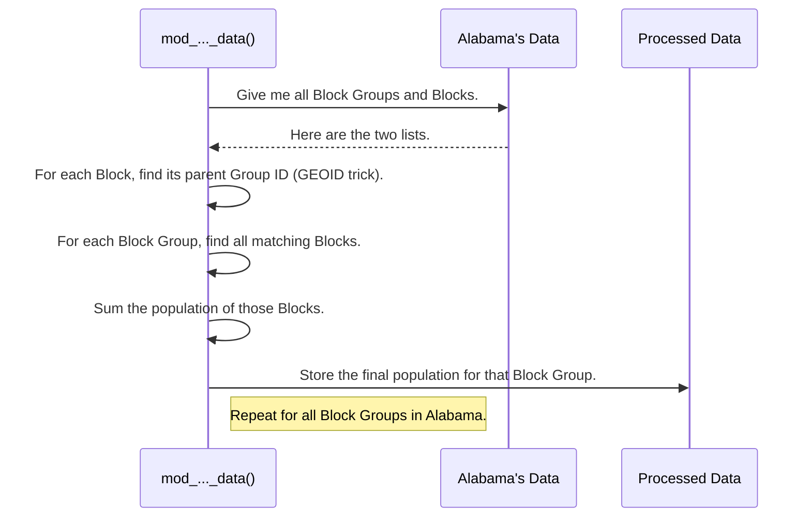

# Chapter 4: Hierarchical Data Aggregation

In the [last chapter](03_state_segregated_data_structure_.md), we saw how our project organizes vast amounts of census data into a neat "digital filing cabinet," with one drawer for each state. This organization is key to everything we do next.

Now, we'll finally get to the heart of our data processing: cooking the main dish. We have detailed population counts for millions of tiny **Census Blocks**, but what we often need is the total population for larger regions, like **Block Groups** or **Census Tracts**. How do we calculate that?

### Rolling Up the Numbers

Imagine a company's budget. The total budget for the Engineering Department isn't just a single number that appears out of nowhere. It's the sum of the budgets for the Web Team, the Mobile Team, and the Data Team. To get the department's budget, you "roll up" the numbers from the individual teams.

This is exactly what **Hierarchical Data Aggregation** is. Census geography is a **hierarchy**:
*   Multiple **Blocks** are nested inside one **Block Group**.
*   Multiple **Block Groups** are nested inside one **Census Tract**.
*   Multiple **Tracts** are nested inside one **County**.

Our goal is to "roll up" the population data from the smallest level (Blocks) to calculate the totals for the larger levels (Block Groups and Tracts).

```mermaid
graph TD
    subgraph County
        subgraph Tract_A
            subgraph Block_Group_1
                Block_a[Block a (Pop: 50)]
                Block_b[Block b (Pop: 30)]
            end
            subgraph Block_Group_2
                Block_c[Block c (Pop: 120)]
            end
        end
    end

    Block_a & Block_b --> BG1_Total{"Block Group 1 Pop = 80"}
    Block_c --> BG2_Total{"Block Group 2 Pop = 120"}
    BG1_Total & BG2_Total --> Tract_A_Total{"Tract A Pop = 200"}
```

This "roll-up" process is the core logic of our project. Functions like `mod_block_group_data_rev1.m` and `add_pop_tract_data_rev1.m` are our specialized accountants that perform this aggregation.

### The Secret: Matching with GEOIDs

How do we know which Blocks belong to which Block Group? It would be incredibly slow to check maps for every single one. Luckily, the Census Bureau gives us a brilliant shortcut: the **GEOID**.

A GEOID is a unique number assigned to every geographic area. The magic is that a child area's GEOID contains the full ID of its parent.

Let's look at an example from Alabama:
*   A **Block Group** has a 12-digit GEOID: `010730001011`
*   A **Block** *inside* that group has a 15-digit GEOID: `010730001011005`

Do you see the pattern?
```
Block Group GEOID:  010730001011
Block GEOID:        010730001011  005
```
The Block's ID is just its parent Block Group's ID with three extra digits tacked on the end! This means we can find any Block's parent by simply trimming the last three digits from its GEOID. This simple trick is the key to our entire aggregation strategy.

### A Walkthrough of the Aggregation Logic

Let's see how a function like `mod_block_group_data_rev1.m` uses this trick to calculate the population for all Block Groups in a single state. Remember our "filing cabinet" from [Chapter 3: State-Segregated Data Structure](03_state_segregated_data_structure_.md)? Our function will process it one drawer at a time.

Here's the logical flow for one state, say, Alabama:
1.  **Get the Data:** Pull out Alabama's Block Group data and Block data from our two "filing cabinets" (`cell` arrays).
2.  **Prepare for Matching:** Create a list of all Block GEOIDs and trim the last three digits off each one. Now we have a list of parent IDs.
3.  **Match Blocks to Groups:** Use a fast lookup to figure out which Block Group each Block belongs to.
4.  **Sum the Populations:** Go through each Block Group one-by-one. Find all the Blocks that belong to it and sum up their populations.
5.  **Update and Save:** Add the calculated population to the Block Group data and put the updated file back in the "drawer".

This process is repeated for every state.



### Looking at the Code

Let's peek at simplified snippets from `mod_block_group_data_rev1.m` to see this in action.

#### Step 1: The State-by-State Loop

First, the function sets up a loop to work through our "filing cabinet," exactly as we discussed in Chapter 3.

```matlab
% Loop through every state, from 1 to 56
for state_idx = 1:1:num_states
    
    % Get the block data for just this one state
    temp_state_block = cell_block_data{row_match_idx, 2};
    % Get the block group data for this state
    temp_state_group_data = mod_cell_block_group_data{state_idx, 2};

    % ... All the aggregation logic for one state happens here ...
end
```
This ensures we only have to think about one state at a time, making the problem much simpler.

#### Step 2: Matching with `ismember`

Instead of manually trimming strings, MATLAB gives us a powerful function, `ismember`, that can match two lists very quickly. Our code performs the GEOID trick and then uses `ismember` to do the lookup.

```matlab
% temp_block_geoid contains the trimmed GEOIDs from the Blocks.
% temp_state_group_data(:, 5) is the list of Block Group GEOIDs.

% 'Locb' is now a list that tells us which group each block belongs to.
% For example, Locb(10) = 5 means the 10th block belongs to the 5th group.
[~, Locb] = ismember(temp_table_block, temp_table_group, 'rows');
```

#### Step 3: Summing the Populations

Now that we know which blocks belong to which groups, we can loop through each group and add up the numbers.

```matlab
% Get the number of block groups in this state
[num_groups, ~] = size(temp_state_group_data);

% Loop through each block group
for group_idx = 1:1:num_groups
    % Find the indices of all blocks that belong to THIS group
    sub_match_idx = find(group_idx == Locb);
    
    % Sum the population (in column 6) for just those blocks
    group_pop(group_idx) = sum(temp_state_block(sub_match_idx, 6));
end
```
And that's it! After this loop, `group_pop` contains the calculated population for every Block Group in the state. This new data is added as a new column to our dataset.

### What if the GEOID Trick Fails?

Real-world data is messy. For historical reasons, the state of Connecticut (FIPS code 9) doesn't use a GEOID system that allows for our simple trimming trick. When our code gets to Connecticut, the `if block_state == 9` condition becomes true, and it must switch to a backup plan.

This backup plan is much more complex: it uses pure geography. For each Block, it finds its center point (latitude and longitude) and then checks which Block Group's polygon boundary that point falls inside.

This "point-in-polygon" method is a fundamental concept in geospatial analysis, and it's so important that it gets its own chapter!

### Conclusion

You now understand the core "recipe" of this project! **Hierarchical Data Aggregation** is the process of rolling up data from smaller geographic areas to larger ones. We achieve this by:

*   Taking advantage of the nested structure of Census geography.
*   Using the clever **GEOID trick** to efficiently match child areas to their parents.
*   Processing the data one state at a time using our **State-Segregated Data Structure**.

We also saw a glimpse of what happens when our simple rules don't apply, forcing us to use more advanced geographic calculations.

Next up: [Chapter 5: Geospatial "Point-in-Polygon" Analysis](05_geospatial__point_in_polygon__analysis_.md)

---

Generated by [AI Codebase Knowledge Builder](https://github.com/The-Pocket/Tutorial-Codebase-Knowledge)