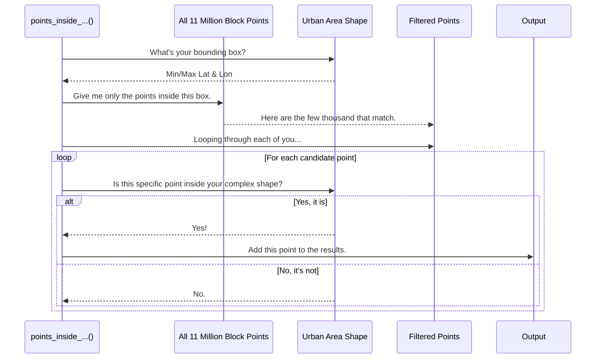

# Chapter 5: Geospatial "Point-in-Polygon" Analysis

In [Chapter 4: Hierarchical Data Aggregation](04_hierarchical_data_aggregation_.md), we discovered a powerful shortcut for combining census data: the GEOID trick. But we also saw that this trick has a weakness. For certain states like Connecticut, the ID numbers don't line up perfectly, and our shortcut fails.

When our simple rules don't work, we need to fall back on a more fundamental method—one that uses pure geography. This method is called **"Point-in-Polygon" Analysis**.

### The Digital Cookie Cutter

Imagine you have a big sheet of rolled-out cookie dough. You've sprinkled different colored sugar all over it. Each tiny grain of sugar is a **point**. Now, you take a star-shaped cookie cutter—a **polygon**—and press it into the dough.

Point-in-Polygon analysis is the process of figuring out exactly which grains of sugar are *inside* the star shape you just cut out.

In our project:
*   **The "Points"** are the geographic centers (latitude and longitude) of millions of tiny census blocks. Each point has a population attached to it.
*   **The "Polygon"** is any defined geographic boundary, like a Block Group, an "Urban Area," or a "Partial Economic Area" (PEA). It's essentially a list of coordinates that form a closed shape on a map.

Our goal is to use this "cookie cutter" technique to determine which census blocks fall inside a specific geographic zone, allowing us to sum up their populations.

```mermaid
graph TD
    subgraph Map Area
        P1(Point A)
        P2(Point B)
        P3(Point C)
        P4(Point D)
        subgraph Polygon Boundary (e.g., Urban Area)
            direction LR
            style Polygon Boundary fill:#ccf,stroke:#333,stroke-width:2px
            P2(Point B)
            P3(Point C)
        end
    end

    Result1["<b>Inside:</b> Point B, Point C"]
    Result2["<b>Outside:</b> Point A, Point D"]
    Polygon Boundary --> Result1
    Polygon Boundary --> Result2
```

### The Challenge: How to Be Fast and Smart

Checking if a single point is inside a single polygon involves some moderately complex math. Now, imagine doing that for **11 million points** (all US census blocks) for **thousands of polygons** (all US Block Groups). If we check every single point against every single polygon, our computer would be running for days!

We need a faster way. This is where a clever optimization called the **Bounding Box Check** comes in.

Before we do the slow, precise check, we do a super-fast, simple check first. We draw a simple rectangle (a "bounding box") around our complex polygon.

1.  **The Quick Filter (Bounding Box):** Is the point inside this simple rectangle?
    *   **No?** Great! It's definitely not inside the complex polygon. We can ignore this point and move on instantly.
    *   **Yes?** Okay, *now* we need to do the full, slower check to see if it's inside the actual cookie-cutter shape.

This two-step process saves an enormous amount of time. We might eliminate 99% of the points with the lightning-fast box check, leaving only a handful for the more difficult calculation.

### A Walkthrough of the `points_inside_urban_areas_rev1.m` Logic

Let's see how our project uses this technique to find all the census blocks that lie within a specific Urban Area. A function like `points_inside_urban_areas_rev1.m` handles this.

The process for a single urban area (our polygon) looks like this:



By filtering down to `CandidatePoints` first, the function avoids doing the slow check on millions of irrelevant points.

### Diving into the Code

Let's look at simplified snippets from `points_inside_urban_areas_rev1.m` to see this in action. The function loops through a list of urban areas, performing this check for each one.

#### Step 1: The Main Loop

First, the code sets up a loop to process one urban area polygon at a time.

```matlab
% cell_urban_area_data contains a list of all urban areas and their boundaries.
[num_urban, ~] = size(cell_urban_area_data);

% Loop through each urban area
for row_idx = 1:1:num_urban
    % Get the boundary coordinates for this one urban area
    temp_contour = cell_urban_area_data{row_idx, 3};
    
    % ... The rest of the logic happens inside this loop ...
end
```
This is the same "one at a time" strategy we saw in previous chapters, which keeps our logic simple and focused.

#### Step 2: The Bounding Box Check

Next, it calculates the simple rectangular bounding box for the current urban area and finds all points that fall within it.

```matlab
% Get the min/max latitude and longitude for the polygon's bounding box
min_lat = min(temp_contour(:, 1));
max_lat = max(temp_contour(:, 1));
min_lon = min(temp_contour(:, 2));
max_lon = max(temp_contour(:, 2));

% Find indices of points inside the box (this is a very fast operation)
check_latlon_idx = find_points_in_box(...
    input_latlon, min_lat, max_lat, min_lon, max_lon);
```
`check_latlon_idx` now holds a much smaller list of "candidate" points. If this list is empty, we can skip straight to the next urban area!

#### Step 3: The Full `inpolygon` Check

Now, for the small number of candidate points, we perform the final, precise check using MATLAB's built-in `inpolygon` function.

```matlab
% Loop through only the candidate points
for pos_idx = 1:1:length(check_latlon_idx)
    
    % Get the actual index of the point we are checking
    current_point_index = check_latlon_idx(pos_idx);
    
    % Is this point's (lon, lat) inside the polygon's (lon, lat) boundary?
    tf_inside = inpolygon(...
        input_latlon(current_point_index, 2), ... % Point's longitude
        input_latlon(current_point_index, 1), ... % Point's latitude
        temp_contour(:, 2), ...                  % Polygon's longitudes
        temp_contour(:, 1) ...                   % Polygon's latitudes
    );

    if tf_inside == 1
        % If yes, save its index to our list of results!
        % ... code to store the result ...
    end
end
```
This loop is the core of the analysis. The `inpolygon` function is the real "cookie cutter" that gives us a definite `yes` or `no`.

### Conclusion

You've just learned one of the most fundamental tools in geospatial programming! **Point-in-Polygon analysis** is our go-to method for associating location-based data (like census blocks) with geographic zones (like urban areas).

We learned that:
*   It works by checking if a point's coordinates fall within a polygon's boundary.
*   A "brute-force" approach is too slow for large datasets.
*   The **Bounding Box Check** is a critical optimization that filters out most points quickly, making the whole process feasible.

This kind of analysis can be computationally expensive. We definitely don't want to run it every time we need the data. So, how do we save our results so we can load them instantly next time? And what happens if the saved file gets corrupted?

Next up: [Chapter 6: Caching with Corruption Handling](06_caching_with_corruption_handling_.md)

---

Generated by [AI Codebase Knowledge Builder](https://github.com/The-Pocket/Tutorial-Codebase-Knowledge)