# Chapter 6: Caching with Corruption Handling

In the [previous chapter](05_geospatial__point_in_polygon__analysis_.md), we explored how our project performs complex geospatial analysis, like figuring out which of 11 million census blocks fall inside a specific urban area. As you can imagine, calculations like that are incredibly slow. Running them can take minutes or even hours.

If we had to re-run these heavy calculations every single time we ran our script, it would be a huge waste of time. We need a way to do the hard work once and then save the results for instant access later.

### Take Notes, Don't Re-watch the Meeting

Imagine you sit through a three-hour meeting. The next day, your boss asks for a key takeaway. Would you re-watch the entire three-hour recording? Of course not! You'd simply look at the notes you took.

**Caching** is the programming equivalent of taking good notes. When we perform a slow operation (like processing a huge shapefile), we save the final, clean result into a simple, fast-loading `.mat` file. This `.mat` file is our "cache."

The next time we run the script, it follows a simple rule:
1.  Look for the "notes" (the `.mat` cache file).
2.  If the notes exist, load them instantly. The job is done in a fraction of a second.
3.  If there are no notes, then (and only then) run the slow, three-hour process and save the results as new notes for next time.

This pattern makes our code incredibly efficient.

### The Problem: What if Your Notes are Unreadable?

Now, imagine you took your meeting notes, but then you spilled coffee all over them. The paper exists, but the ink is smeared and the notes are useless. A simple check for "Do I have my notebook?" isn't enough. You have to be able to *read* the notes.

The same problem can happen with our cache files. If your computer crashes or the program is interrupted while it's saving a large `.mat` file, you can end up with a **corrupted file**. The file exists on your hard drive, but it's incomplete or broken. If our program tries to load this broken file, it will crash.

So, how do we build a system that is not only fast but also robust enough to handle these "coffee-smeared" files?

### The Solution: A Smart "Note-Checker"

Our project uses a very clever helper function that acts as a smart "note-checker." Before using a cache file, this function doesn't just check if it exists—it also tries to read it to make sure it's not corrupted.

Here’s the logic this helper function follows:
1.  **Check for the file:** Does `my_results.mat` exist?
2.  **If it exists, test it:**
    *   `try` to load the file into memory.
    *   If the `load` works perfectly, great! The file is good. Tell the main script to use it.
    *   If the `load` fails (it `catch`es an error), that means the file is corrupt. The helper function immediately **deletes the broken file** and tells the main script that there is no valid file.
3.  **If the file does not exist** (either from the start or because it was just deleted), the main script knows it must perform the slow processing from scratch.

This `try-catch-delete` pattern is the secret to a resilient system. It automatically heals itself by removing bad files and re-creating them.

### A Walkthrough of the Caching Logic

Let's see this robust caching system in action. Almost every data-loading or processing function in our project uses this pattern. Here is a diagram showing what happens when a function asks for data that should be cached.

```mermaid
sequenceDiagram
    participant MainFunction as scrap_..._data()
    participant Helper as persistent_var_...()
    participant CacheFile as my_results.mat
    participant SlowProcess as shaperead()

    MainFunction->>Helper: Is my_results.mat valid?
    Helper->>CacheFile: Do you exist?
    CacheFile-->>Helper: Yes.
    Helper->>CacheFile: Okay, I'll try to load you...
    Note right of Helper: Tries `load('my_results.mat')`
    alt File is Corrupt
        CacheFile-->>Helper: ERROR! I am broken!
        Helper->>CacheFile: You're no good. I'm deleting you!
        Helper-->>MainFunction: No valid file exists.
    else File is Good
        CacheFile-->>Helper: Here is the data.
        Helper-->>MainFunction: Yes, file is valid. Here's the data.
    end

    alt MainFunction received "No valid file"
        MainFunction->>SlowProcess: I need to run the slow process.
        SlowProcess-->>MainFunction: Here are the fresh results.
        MainFunction->>CacheFile: Save these fresh results.
    end
```



This automatic detection and healing is what makes our data pipeline so reliable.

### Diving into the Code

Let's look at how this is implemented. First, we'll see a function that *uses* our smart helper, and then we'll peek inside the helper itself.

#### Using the Caching Helper

A typical data-scraping function, like `scrap_urban_area_data_rev1.m`, starts by checking for a cached version of its data.

```matlab
function [cell_urban_area_data] = scrap_urban_area_data_rev1(...)

    % Define the name of the cache file we are looking for.
    cell_area_filename = 'cell_urban_area_data_some_region.mat';
    
    % Call our smart helper to check if a VALID file exists.
    [var_exist_input] = persistent_var_exist_with_corruption(app, cell_area_filename);
    
    if var_exist_input == 2 % Helper says a good file exists!
        % Great! Just load the fast cache file.
        load(cell_area_filename, 'cell_urban_area_data');
    else % Helper says no file exists (or it was corrupt and is now deleted).
        % --- Do the slow processing here ---
        % ... read raw shapefile, extract columns, clean data ...
        
        % --- Save the new results for next time ---
        save(cell_area_filename, 'cell_urban_area_data');
    end
end
```
Notice the clean `if/else` logic. The function completely trusts the helper, `persistent_var_exist_with_corruption`, to tell it whether it needs to do the hard work or can take the easy path.

#### Inside the Helper: `persistent_var_exist_with_corruption.m`

Now for the magic. Let's look at a simplified version of our smart "note-checker" helper function.

```matlab
function [var_exist] = persistent_var_exist_with_corruption(app, file_name)

    % First, a simple check: does the file exist at all?
    var_exist = exist(file_name, 'file');

    % If it exists, we need to test if it's readable.
    if var_exist == 2
        tf_delete = 0; % A flag to track if we delete it.
        try
            % Try to load the file. This is the real test.
            load(file_name); 
            
        catch error_msg
            % If we end up in 'catch', the 'try' failed! The file is corrupt.
            disp('File might be corrupt. Deleting it.');
            delete(file_name); % Delete the broken file.
            tf_delete = 1;     % Set our flag.
        end
        
        % If we deleted the file, we must report that it no longer exists.
        if tf_delete == 1
            var_exist = 0;
        end
    end
end
```

Let's break this down:
1.  **`exist(file_name, 'file')`**: This is MATLAB's standard way to check if a file exists. It returns `2` if it does.
2.  **`try...catch` block**: This is the heart of our corruption handling.
    *   The code in the `try` block is executed. If it runs without any errors, the `catch` block is skipped entirely.
    *   If an error *does* occur during the `load(file_name)` command, MATLAB immediately jumps to the `catch` block.
3.  **`delete(file_name)`**: Inside the `catch` block, we know the file is bad, so we simply delete it from the hard drive.
4.  **`var_exist = 0`**: After deleting the file, we change our return value to `0` (or `false`), signaling to the main function that it needs to re-process the data.

### Conclusion

You now understand one of the most important and widespread patterns in this entire project. **Caching with Corruption Handling** is what makes our system both fast and robust. By saving the results of slow operations, we avoid repeating work. By intelligently checking for and deleting corrupted files, we ensure our system can automatically recover from errors.

This pattern of "check-or-create" is the silent workhorse that makes our entire data pipeline practical to run. You will see it used in almost every function that reads, processes, or saves data.

---

Generated by [AI Codebase Knowledge Builder](https://github.com/The-Pocket/Tutorial-Codebase-Knowledge)