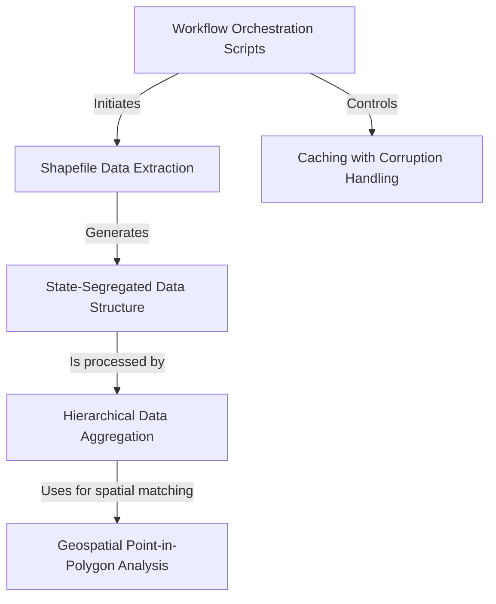

# Tutorial: Census_Data_Processing

The `Census_Data_Processing` project is a MATLAB pipeline designed to handle large-scale **US Census data**. Its main job is to *extract geographic and demographic information* (like population counts and boundaries) from raw Census TIGER/Line shapefiles. The project then performs key analyses, such as **aggregating population data** from smaller areas (e.g., blocks) into larger ones (e.g., tracts) and conducting *geospatial "point-in-polygon" tests* to link population centers to specific zones like urban areas. The entire workflow is managed by orchestration scripts that ensure data is processed, cached for speed, and saved in a structured, state-by-state format.

**Source Repository:** [Census_Data_Processing](https://github.com/nicklasorte/Census_Data_Processing)

## Chapters

1. [Workflow Orchestration Scripts
](01_workflow_orchestration_scripts_.md)
2. [Shapefile Data Extraction
](02_shapefile_data_extraction_.md)
3. [State-Segregated Data Structure
](03_state_segregated_data_structure_.md)
4. [Hierarchical Data Aggregation
](04_hierarchical_data_aggregation_.md)
5. [Geospatial "Point-in-Polygon" Analysis
](05_geospatial__point_in_polygon__analysis_.md)
6. [Caching with Corruption Handling
](06_caching_with_corruption_handling_.md)

---

Generated by [AI Codebase Knowledge Builder](https://github.com/The-Pocket/Tutorial-Codebase-Knowledge)
