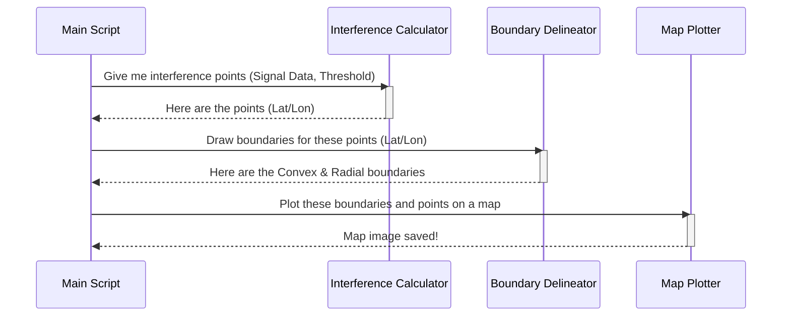

# Chapter 1: Coordination Zone Delineation

Welcome to the `Generic_Bugsplat` project! If you've ever wondered how we can predict and map out potential radio interference, you're in the right place. This first chapter introduces a fundamental concept: drawing boundaries on a map to define areas of high interference.

Let's start with an analogy. Imagine you're setting up a powerful new radio station. You need to know exactly where its signal will be so strong that it might disrupt other existing services, like TV broadcasts or emergency communications. Your goal is to draw a "keep out" zone on a map, showing everyone where this potential interference exists.

**Coordination Zone Delineation** is the process of creating these "keep out" zones, which we call coordination zones. It takes raw signal strength data and, based on a defined "too loud" level, automatically draws boundaries around the affected areas.

---

### From Data Points to Map Boundaries

At its core, this module answers a simple question: Given thousands of signal strength measurements across a geographic area, how do we draw a single, clear boundary around all the locations where the signal is too strong?

This process identifies all the individual points on a map grid where interference is predicted. But a cloud of points isn't very useful for planning. We need a solid line—a polygon—that contains them all. This project calculates two types of boundaries for this purpose.

#### 1. The Convex Hull: The "Rubber Band" Method

The simplest way to enclose a set of points is to imagine stretching a giant rubber band around the outermost points. This is called a **convex hull**. It's a quick and easy way to get a general outline of the interference area.

```mermaid
graph TD
    subgraph Convex Hull
        A[Point]
        B[Point]
        C[Point]
        D[Point]
        E[Point]
        F[Point]
        A---B---D---E---A
    end

    style A fill:#f9f,stroke:#333,stroke-width:2px
    style B fill:#f9f,stroke:#333,stroke-width:2px
    style C fill:#f9f,stroke:#333,stroke-width:2px
    style D fill:#f9f,stroke:#333,stroke-width:2px
    style E fill:#f9f,stroke:#333,stroke-width:2px
    style F fill:#f9f,stroke:#333,stroke-width:2px

    linkStyle 0,1,2,3,4 stroke-width:3px,stroke:green,stroke-dasharray: 5 5;

    classDef default fill:#fff,stroke:#fff
```
*The green dashed line represents the convex hull, like a rubber band stretched around all the points.*

#### 2. The Radial Boundary: The "Tracing" Method

Sometimes, a rubber band is too simple. Interference doesn't always spread out in a nice, roundish shape. It might flow into valleys and be blocked by hills, creating a more complex, star-like pattern. A **radial** (or concave) boundary provides a more detailed and accurate outline by "tracing" the actual shape of the interference points. It hugs the contours of the data much more tightly.

This method is like carefully tracing the coastline of an island, including its bays and peninsulas, instead of just drawing a circle around it.

### How It Works: A High-Level View

The main script that handles this process is `part2_bugsplat_maps_azimuth_radial_rev11.m`. Let's walk through what it does with a simplified example.

**Inputs:**
*   A list of grid points on a map (`sim_array_list_bs`).
*   The predicted signal loss (path loss) to each of those points (`array_full_pl_data`).
*   A "required" path loss value. If the actual path loss is *less* than this, the signal is considered too strong (`azi_required_pathloss`).

**Core Logic:**

The first step is to figure out which locations are actually a problem. The code calculates a "margin" for each point. A positive margin means the signal is stronger than our allowed limit.

```matlab
% How much does our signal exceed the allowed limit?
array_margin_dB = bs_required_pathloss - array_full_pl_data;

% Find all grid points where the margin is positive (i.e., too strong).
over_pl_idx = find(array_margin_dB > 0);
```
In this snippet, `over_pl_idx` now holds the list of all our "interference points."

Next, these points are passed to a helper function, `plot_zone_miti_reli_radial_rev3`, which does the actual drawing.

```matlab
% These are the geographic coordinates (Lat/Lon) of our interference points.
keep_grid_pts = sim_array_list_bs(over_pl_idx, [1,2]);

% Method 1: Stretch a rubber band (Convex Hull).
bound_idx = boundary(keep_grid_pts(:,2), keep_grid_pts(:,1), 0);
convex_bound = keep_grid_pts(bound_idx,:);

% Method 2: Trace the outline closely (Radial Boundary).
% This uses a helper to find the outermost point at each angle.
[radial_bound] = radial_bound_rev2(app, center_point, keep_grid_pts, ...);
```
This code calculates the coordinates for both the simple `convex_bound` and the more detailed `radial_bound`.

**Outputs:**
*   A set of coordinates for the convex hull boundary.
*   A set of coordinates for the more detailed radial boundary.
*   A PNG image showing these boundaries plotted on a map.


*An example output showing the simple convex hull (green) and the more detailed radial boundary (black) around interference points.*

### Under the Hood: The Process Flow

Let's visualize the entire sequence of events from start to finish.



1.  **Main Script**: The main script (`part2_..._rev11.m`) kicks off the process.
2.  **Interference Calculator**: It first calculates the margin to identify all points exceeding the interference threshold.
3.  **Boundary Delineator**: It then passes this list of "bad" points to the boundary calculation logic (`plot_zone_miti_reli_radial_rev3.m`).
4.  **Map Plotter**: Finally, it takes the generated boundary coordinates and uses them to create and save a visual map.

### Diving Deeper into the Code

The main script is designed to run these calculations for many different scenarios (e.g., different weather conditions or "reliability" levels). It loops through each scenario and generates a unique set of boundaries.

Inside `part2_bugsplat_maps_azimuth_radial_rev11.m`, you'll find this loop:

```matlab
% Loop through different mitigation and reliability scenarios...
for rel_idx = 1:1:num_rels
    for miti_idx = 1:1:num_miti
        % ... code to calculate the interference margin ...

        % Call our helper function to get the boundaries
        [max_knn_dist, convex_bound, max_int_dB, radial_bound] = ...
            plot_zone_miti_reli_radial_rev3(app, temp_margin, ...);
        
        % Store the results
        cell_bound_miti{miti_idx, 3, rel_idx} = convex_bound;
        cell_bound_miti{miti_idx, 6, rel_idx} = radial_bound;
    end
end
```
This shows how the main script orchestrates the work, calling the `plot_zone_miti_reli_radial_rev3` function to do the heavy lifting for each case and storing the results.

Inside that helper function, the final step is to plot the data and save the image.

```matlab
% Create a new figure to draw on
f1 = figure;
hold on;

% Plot the simple "rubber band" boundary in green
h2 = plot(convex_bound(:,2), convex_bound(:,1), '-g', 'LineWidth', 3);

% Plot the detailed "tracing" boundary in black
h3 = plot(radial_bound(:,2), radial_bound(:,1), '-k', 'LineWidth', 3);

% Scatter the actual interference points
scatter(interference_points(:,2), interference_points(:,1), 10, 'filled');

% Add a Google Map background for context
plot_google_map('maptype','terrain', ...);

% Save the final image to a file
saveas(gcf, char(filename1));
```
This snippet shows how the different boundary types are layered onto a single plot with a map background to create the final, easy-to-understand visualization.

### Conclusion

In this chapter, we've learned about the core concept of Coordination Zone Delineation. We saw how the system transforms thousands of raw data points into clear, visual boundaries on a map. We explored two methods for this: the simple "rubber band" convex hull and the more precise "tracing" radial boundary. This process is the first crucial step in understanding the geographic impact of a radio system.

Now that we understand how to process the data for a single scenario, what if we need to run hundreds or even thousands of these simulations? How do we manage all that work? The next chapter, the [Simulation Workflow Orchestrator](02_simulation_workflow_orchestrator_.md), will show us exactly how the project automates and manages this complex task.

---

Generated by [AI Codebase Knowledge Builder](https://github.com/The-Pocket/Tutorial-Codebase-Knowledge)