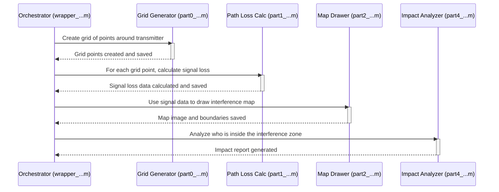

# Chapter 2: Simulation Workflow Orchestrator

In the [previous chapter](01_coordination_zone_delineation_.md), we learned how to take a set of interference data points and draw a clear boundary—a "bugsplat"—on a map. That's a fantastic skill, but it only solves one piece of the puzzle. What happens when you need to run not just one, but hundreds or thousands of these simulations? Maybe you need to test different transmitter powers, antenna heights, or weather conditions. Running each one by hand would take forever!

This is where the **Simulation Workflow Orchestrator** comes in. Think of it as the project's master chef or a symphony conductor. While the other modules know how to do one specific job (like chopping vegetables or playing the violin), the orchestrator holds the master recipe or the musical score. It tells every other module what to do and in what order, ensuring the entire simulation runs perfectly from start to finish.

These orchestrators are the main scripts you run to kick off a full analysis. Understanding them is the key to understanding the high-level flow of the entire `Generic_Bugsplat` project.

---

### The Master Recipe for an Interference Study

Imagine you're trying to bake a cake. You wouldn't just mix all the ingredients randomly. You'd follow a recipe:
1.  Preheat the oven.
2.  Mix the dry ingredients.
3.  Mix the wet ingredients.
4.  Combine them.
5.  Pour into a pan and bake.
6.  Cool and frost.

Our simulation orchestrators, which are scripts with names like `wrapper_bugsplat_rev5.m`, work in the exact same way. They define a sequence of steps that must be followed to produce the final result—a complete interference analysis.

The typical workflow looks like this:
1.  **Setup the Environment**: Load all the input settings and start up processing resources.
2.  **Generate the Grid**: Create the geographic map area for the simulation.
3.  **Calculate Path Loss**: Determine how strong the signal is at every point on the grid.
4.  **Create the "Bugsplat"**: Draw the interference zone boundaries on a map.
5.  **Analyze the Impact**: Figure out what (or who) is affected by the interference.
6.  **Report the Results**: Save all the data, maps, and reports.

By calling specialized scripts for each step, the orchestrator automates this entire process.

### A Look at a Typical Orchestrator

Let's peek inside a simplified version of an orchestrator script, like `wrapper_bugsplat_rev5.m`. Don't worry about the details; focus on the sequence of commands. It reads just like a recipe.

First, the script gathers all the "ingredients" or settings for our simulation.

```matlab
% Load all simulation settings from files
[reliability] = load_data_reliability(app);
[FreqMHz] = load_data_FreqMHz(app);
[grid_spacing] = load_data_grid_spacing(app);
% ... and so on for all other parameters ...
```
This part is like getting your flour, sugar, and eggs out of the cupboard before you start mixing. It loads configuration values like frequency, grid size, and more.

Next, it prepares the "kitchen" by setting up the computer's resources. The code below checks if it can run tasks in parallel (doing multiple things at once) to speed up the simulation. This is a powerful feature we'll explore later in the [Distributed Task Management](08_distributed_task_management_.md) chapter.

```matlab
% Check if we can use multiple computer cores to speed things up
[workers, parallel_flag] = check_parallel_toolbox(app, parallel_flag);

% Start the parallel processing pool if available
[poolobj, cores] = start_parpool_poolsize_app(app, parallel_flag, workers);
```

Now for the main cooking steps! The orchestrator calls other scripts, each responsible for one part of the workflow.

```matlab
% Step 0: Create the map grid for our simulation.
part0_grid_pts_rev3_server(app, ...);

% Step 1: Calculate signal loss across the grid.
part1_calc_pathloss_dynamic_num_chunks_rev8(app, ...);

% Step 2: Draw the interference maps we learned about in Chapter 1.
part2_bugsplat_maps_both_rev7(app, ...);

% Step 4: Analyze the impact on population within the zones.
part4_census_pop_impact_rev5(app, ...);
```
Each `partX_...` script is a dedicated module. The orchestrator simply calls them in the correct order. Notice how the script names clearly describe their purpose.

### How It Works: Under the Hood

Let's visualize the flow of information as the orchestrator does its job. The `wrapper_...` script acts as the central coordinator, passing data from one stage to the next.



As you can see, the orchestrator doesn't perform the calculations itself. It directs traffic, ensuring that the output of one module becomes the input for the next, creating a seamless pipeline.

### Diving Deeper into the Code

Let's connect this back to the modules we will cover in this tutorial.

1.  **Grid Generation**: The call to `part0_grid_pts_rev3_server(...)` kicks off the process described in the [Geographic Simulation Grid Generation](03_geographic_simulation_grid_generation_.md) chapter. It lays down the digital graph paper on which our map will be drawn.

    ```matlab
    % Step 0: Make the grid points
    part0_grid_pts_rev3_server(app, sim_number, folder_names, ...);
    ```

2.  **Path Loss and Mapping**: The calls to `part1_...` and `part2_...` handle the core calculations. `part1_...` computes the signal strength, and `part2_...` uses that data to perform the [Coordination Zone Delineation](01_coordination_zone_delineation_.md) that we saw in the first chapter. The results are often turned into maps and other figures, as we'll see in the [Visualization and Reporting](05_visualization_and_reporting_.md) chapter.

    ```matlab
    % Step 1: Calculate how the signal travels (path loss)
    part1_calc_pathloss_dynamic_num_chunks_rev8(app, ...);
    
    % Step 2: Make the map using the path loss data
    part2_bugsplat_maps_both_rev7(app, ...);
    ```

3.  **Impact Analysis**: Finally, the call to `part4_...` takes the final interference zone and compares it against other data, like population density maps. This allows us to answer important questions like, "How many people are affected by this interference?" We will explore this in detail in the [Population & PEA Impact Analysis](04_population___pea_impact_analysis_.md) chapter.

    ```matlab
    % Step 4: Calculate the population impact
    part4_census_pop_impact_rev5(app, ...);
    ```

Different `wrapper_...` files (like `wrapper_bugsplat_rev3.m` or `wrapper_bugsplat_azimuth_rev9.m`) exist because some studies require a slightly different recipe—perhaps they use a different path loss model or need a more advanced type of impact analysis. However, they all follow this same fundamental "orchestrator" pattern.

### Conclusion

In this chapter, we've moved from a single task to a complete, automated workflow. We learned that the Simulation Workflow Orchestrator is the master script that acts as a "conductor" or "recipe" for the entire project. It calls various specialized modules in a precise sequence to run a simulation from start to finish. These `wrapper_...` files are your entry point for running complex studies and provide a high-level map of how the entire system works together.

The very first step in any simulation is defining the "world" it will operate in. Our orchestrator does this by calling the grid generation module. In the next chapter, we'll dive into exactly how that works in [Geographic Simulation Grid Generation](03_geographic_simulation_grid_generation_.md).

---

Generated by [AI Codebase Knowledge Builder](https://github.com/The-Pocket/Tutorial-Codebase-Knowledge)