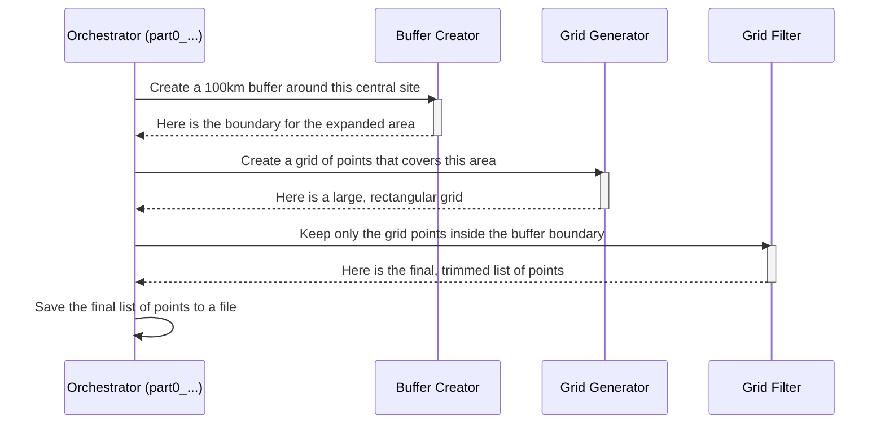

# Chapter 3: Geographic Simulation Grid Generation

In the [previous chapter](02_simulation_workflow_orchestrator_.md), we learned how the **Simulation Workflow Orchestrator** acts as a master conductor, telling all the other parts of our project what to do and when. The very first command it gives is: "Prepare the playing field!"

Before we can simulate signal strength or map out interference, we need to define the area we care about. This process is called **Geographic Simulation Grid Generation**. It's the foundational step that creates the "game board" for our entire simulation.

Imagine you want to measure rainfall across a national park. You wouldn't just wander around randomly. Instead, you'd lay a grid over the park's map and place a rain gauge at every single intersection. That way, you could systematically measure the rain and get a complete picture of the whole area. Our simulation does the exact same thing, but with radio signals instead of rain.

---

### Creating the "Game Board"

At its heart, this module answers the question: "Where exactly on the map should we perform our calculations?" It creates a structured grid of geographic points (latitude and longitude) that covers our entire area of interest.

There are two key ideas to understand:

1.  **The Center Point:** This is the location of our transmitter, like a federal radar site. It's the center of our universe for this simulation.
2.  **The Buffer Zone:** Radio signals don't just stop at the transmitter's property line; they travel for many miles. To capture the full extent of potential interference, we create a large "buffer zone" or "simulation radius" around the center point. This ensures our game board is big enough to see the whole picture.

The goal is to fill this buffer zone with an evenly spaced grid of points. All of our later calculations—like figuring out signal strength or population impact—will be done for each and every one of these points.


*A central site (black dot), a buffer zone (blue circle), and the final simulation grid points (red dots) where we'll do our work.*

### How It Works: A Step-by-Step Guide

The main script that manages this process is called by our orchestrator, often named something like `part0_grid_pts_rev3_server.m`. It takes a few simple inputs and produces a list of coordinates.

**Inputs:**
*   The location of the central site (`base_polygon`).
*   The size of the buffer zone, or radius, in kilometers (`sim_radius_km`).
*   The desired spacing between points on our grid (`grid_spacing`).

**Core Logic:**

The process is like using a set of cookie cutters on a map.

1.  **Create the Buffer:** First, it takes the central site's location and expands it outwards by the buffer distance. This creates a large circular or polygon-shaped area.
2.  **Generate a Grid:** It then creates a simple, rectangular grid of points that is large enough to completely cover this buffer area. Think of it as laying down a big sheet of digital graph paper.
3.  **"Cookie-Cutter" the Grid:** A rectangular grid will include points we don't care about (e.g., points far out in the ocean or in another country). The script uses the buffer zone's boundary as a "cookie cutter" to trim the grid, keeping only the points that fall inside our desired simulation area.

**Outputs:**
*   A big list of latitude and longitude coordinates for every point in our final, trimmed grid (`sim_array_list_bs`). This list is saved to a file, ready for the next stage of the simulation.

### Under the Hood: The Process Flow

Let's visualize how the different parts of the code work together to create our grid.



1.  **Orchestrator**: The main script (`part0_...m`) starts the process.
2.  **Buffer Creator**: It calls a helper function to create the expanded boundary around the central site.
3.  **Grid Generator**: It then generates a large, simple grid of points covering the whole area.
4.  **Grid Filter**: Finally, it filters this big grid, throwing away any points that aren't inside the buffer, resulting in our perfectly shaped "game board."

### Diving Deeper into the Code

Let's look at simplified snippets from the files to see how this is done.

#### 1. Creating the Buffer Zone

The first step is to expand the area around our central site. This is often done in a helper function like `base_buffer_rev1.m`, which uses a built-in function to draw a buffer.

```matlab
% In base_buffer_rev1.m

% Expand the polygon outward by a certain distance
[temp_buff_lat, temp_buff_lon] = bufferm(base_polygon(:,1), ...
                                        base_polygon(:,2), ...
                                        km2deg(min_dist_buff_km));

% Combine the latitude and longitude into our final buffer boundary
base_buffer = horzcat(temp_buff_lat, temp_buff_lon);
```
This code takes the `base_polygon` coordinates and a distance, and `bufferm` does the hard work of calculating the new, expanded boundary.

#### 2. Generating and Filtering the Grid

Next, in a script like `wrapper_grid_points_rev2_outside_USA.m`, the code generates the points. It also often includes a step to make sure the points are within a larger boundary, like the continental US.

```matlab
% In wrapper_grid_points_rev2_outside_USA.m

% Intersect our buffer zone with the US border to define the final area
circle_poly = polyshape(base_buffer(:,2), base_buffer(:,1));
polyout = intersect(circle_poly, ds_poly_us_cont_50km); % ds_poly... is the US border
border_bound = fliplr(polyout.Vertices);

% Call a helper function to fill this final area with points
[raw_grid_points] = grid_points_app(app, border_bound, grid_spacing);
```
Here, the code first finds the `intersect`ion of our simulation buffer and a pre-loaded map of the US. Then, it calls `grid_points_app` to do the actual point generation inside that final shape. The `grid_points_app` function essentially lays down graph paper and marks the points.

#### 3. Saving the Final Result

Once the final list of points is ready, the orchestrator saves it to a file. This file will be the primary input for the next stage of the analysis.

```matlab
% Give each point a unique ID and other info
[num_tx,~] = size(grid_points);
sim_array_list_bs = horzcat(grid_points, NaN(num_tx, 2));
sim_array_list_bs(:,5) = 1:1:num_tx; % Assign unique ID

% Save the final list of grid points to a file
save(strcat(data_label1, '_sim_array_list_bs.mat'), 'sim_array_list_bs');
```
The variable `sim_array_list_bs` now contains the coordinates for every point on our game board, and it's saved so that other modules can use it.

### Conclusion

In this chapter, we've learned how the project creates its "game board"—the geographic simulation grid. We saw that it's not just a simple square; it's a carefully crafted set of points within a buffer zone, shaped to cover the exact area we need to study. This grid generation is the critical first step that makes all subsequent analysis possible.

Now that we have our grid of points, what do we do with them? The next step is to analyze what exists at each of these locations. How many people live there? What kind of environment is it? We'll explore this in the next chapter, [Population & PEA Impact Analysis](04_population___pea_impact_analysis_.md).

---

Generated by [AI Codebase Knowledge Builder](https://github.com/The-Pocket/Tutorial-Codebase-Knowledge)