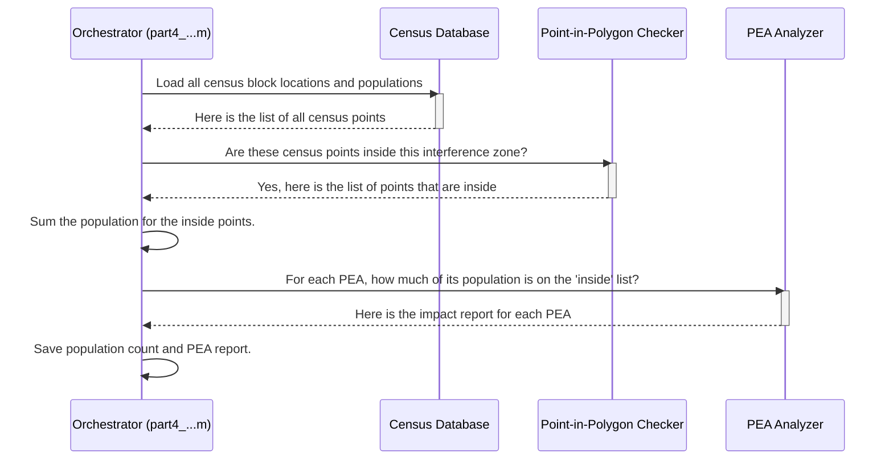

# Chapter 4: Population & PEA Impact Analysis

In the [previous chapter](03_geographic_simulation_grid_generation_.md), we learned how to create our "game board"—a detailed grid of points covering our area of interest. This is a great start, but a blank map doesn't tell us much. We drew our "keep out" zone, but what's actually *in* it? Is it an empty desert, a bustling city, or a valuable commercial area?

This is where **Population & PEA Impact Analysis** comes in. This module takes our abstract interference boundary and gives it real-world meaning. It's like overlaying our "keep out" zone onto a city map to count exactly how many houses and neighborhoods are affected. This step turns our simulation from a technical drawing into a powerful tool for understanding human and economic impact.

---

### From Boundaries to Real-World Impact

The core job of this module is to answer one critical question: "So what?"

We have a polygon on a map representing potential interference. So what? This analysis answers that question by cross-referencing our polygon with two important datasets:

1.  **Census Data:** The government maintains detailed data on where people live, often broken down into tiny areas called "census blocks." By checking which of these blocks fall inside our interference zone, we can get a very accurate count of the **affected population**.

2.  **Partial Economic Areas (PEAs):** These are commercially-defined regions, like metro areas, that the FCC uses to manage spectrum licenses. They represent distinct economic markets. Analyzing the impact on PEAs helps us understand the economic consequences of spectrum restrictions.

By the end of this stage, we can make concrete statements like: "This interference zone affects 1.2 million people and covers 35% of the New York City PEA."

#### Key Terms: Encumbered vs. Unencumbered

You'll often see the terms "encumbered" and "unencumbered" in this analysis. They're just fancy words for a simple idea:

*   **Encumbered:** This means "affected" or "covered." The encumbered population is the number of people living *inside* our interference zone.
*   **Unencumbered:** This means "unaffected" or "available." The unencumbered population is the people in an area who are *outside* the interference zone.

Our goal is to calculate these numbers to quantify the impact.


*Our interference zone (black line) overlaid on a map of census blocks. This module counts the population in all the red blocks to find the "encumbered" population.*

### How It Works: The Big Picture

The process is essentially a digital matching game. The orchestrator script, typically named `part4_census_pop_impact_rev6.m` or similar, directs this entire process.

**Inputs:**
*   The boundary coordinates of our interference zone (the polygon from [Chapter 1](01_coordination_zone_delineation_.md)).
*   A pre-loaded database of US census blocks with their locations and populations (`Cascade_new_full_census_2010.mat`).
*   A pre-loaded database of PEA boundaries (`cell_pea_census_data.mat`).

**Core Logic:**

1.  **Count the People:** The script takes our interference polygon and the list of all census blocks. For each block, it asks a simple question: "Is the center of this block inside the polygon?"
2.  **Sum the Population:** It keeps a list of all the blocks that are inside and then adds up their populations to get a single number: the total encumbered population.
3.  **Analyze the PEAs:** It then repeats a similar process for PEAs. For each PEA, it figures out what percentage of its total population lives inside our interference zone.

**Outputs:**
*   A data file (`cell_miti_contour_pop`) that lists each interference zone and the total population it affects.
*   A map showing all the PEAs, colored according to how much of their population is "available" or "unencumbered."

### Under the Hood: The Process Flow

Let's visualize the step-by-step sequence managed by the `part4_...` script.


1.  **Orchestrator**: The `part4_...` script starts by loading the interference boundary and the necessary databases.
2.  **Point-in-Polygon Checker**: It then passes the list of all census points and the interference polygon to a checker function. This function is the heart of the operation, determining what's in and what's out.
3.  **PEA Analyzer**: With the list of affected census blocks, it calls another helper (`pea_impact_overlap_xor_rev1.m`) to sort these blocks by PEA and calculate the impact percentage for each economic area.

### Diving Deeper into the Code

Let's look at some simplified code snippets to see how this works in practice.

#### 1. Finding the Affected Population

The main script, `part4_census_pop_impact_concave_rev7.m`, loops through each interference boundary it needs to analyze. Inside this loop, the core logic is simple.

```matlab
% In part4_census_pop_impact_concave_rev7.m

% Get the boundary for one interference zone
temp_contour_latlon = cell_bound_miti{row_idx, 6};

% census_latlon contains all census block coordinates in the USA
% This function efficiently finds which ones are inside our boundary.
[inside_idx] = find_points_inside_contour_two_step(app, temp_contour_latlon, census_latlon);

% Sum the population of only the blocks that were inside.
% census_pop is a list of populations for every block.
total_affected_pop = sum(census_pop(inside_idx));

% Store the final number
cell_contour_pop{row_idx, 2} = total_affected_pop;
```
This snippet is the essence of the population analysis. It takes a boundary, finds the points inside using a helper function, and sums their corresponding population values.

#### 2. Analyzing the PEA Impact

Once we know which census blocks are affected, we can analyze the impact on economic areas using a script like `pea_impact_overlap_xor_rev1.m`.

```matlab
% In pea_impact_overlap_xor_rev1.m

% For every PEA in the country...
for pea_idx = 1:1:num_peas
    % Get all the census blocks that make up this PEA
    pea_census_geo_idx = cell_pea_census_data{pea_idx, 6};
    pea_census_pop = cell_pea_census_data{pea_idx, 7};
    
    % Find the overlap between this PEA's blocks and our affected blocks
    % (temp_xor_census_geo_idx is the list of affected census blocks)
    temp_xor_match_idx = intersect(pea_census_geo_idx, temp_xor_census_geo_idx);
    
    % Calculate the percentage of the PEA that is available (unencumbered)
    uncovered_pop = sum(pea_census_pop) - sum(population_of(temp_xor_match_idx));
    available_percentage = uncovered_pop / sum(pea_census_pop);
    
    cell_pea_hist_poly{area_idx, pea_idx, 6} = available_percentage;
end
```
This code calculates, for each PEA, what percentage of its population is *not* affected by our interference zone. This "available percentage" is then used for plotting.

#### 3. Visualizing the PEA Map

Finally, a script like `plot_pea_overlap_rev2_filename.m` takes this data and creates a helpful map. It loops through every PEA and colors it based on the "available percentage" we just calculated.

```matlab
% In plot_pea_overlap_rev2_filename.m

% For each of the 400+ PEAs...
for pea_idx = 1:1:number_markets
    % Get the available population percentage (e.g., 0.85 for 85%)
    temp_percentage = pea_percentage(pea_idx) / 100;
    
    % Pick a color from a gradient based on the percentage
    % 100% available = bright color, 0% available = dark color
    color_idx = ceil(num_colors * temp_percentage);
    
    % Draw the PEA's boundary on the map with the chosen color
    patch(..., 'FaceColor', color_set(color_idx,:));
end
```
The result is a nationwide map where you can see at a glance which economic areas are heavily impacted (darker colors) and which are mostly unaffected (brighter colors).

### Conclusion

In this chapter, we connected our abstract simulation to the real world. We learned how **Population & PEA Impact Analysis** takes an interference boundary and overlays it onto census and economic data. This allows us to quantify the impact in clear, understandable terms: the number of people affected and the percentage of economic markets encumbered. This is a crucial step for making informed decisions about spectrum management.

We've now generated boundaries and analyzed their impact. But how do we present all this information in a way that is easy for humans to understand? The next chapter, [Visualization and Reporting](05_visualization_and_reporting_.md), covers how the project creates a wide array of plots, maps, and summary reports to make sense of all the data we've produced.

---

Generated by [AI Codebase Knowledge Builder](https://github.com/The-Pocket/Tutorial-Codebase-Knowledge)