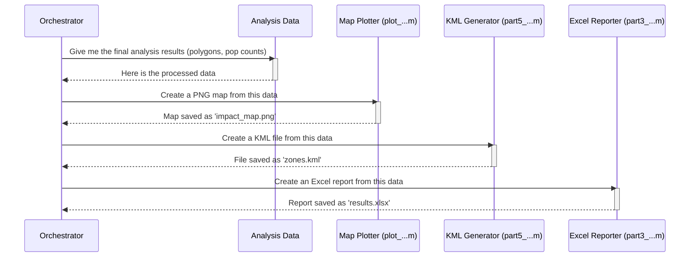

# Chapter 5: Visualization and Reporting

In the [previous chapter](04_population___pea_impact_analysis_.md), we attached real-world meaning to our simulation by calculating the population and economic impact of our interference zones. We now have a lot of powerful data: interference boundaries, lists of affected census blocks, and impact percentages for economic areas. But right now, it's all just numbers and coordinates stored in data files. How do we share these findings with others?

This is the job of the **Visualization and Reporting** stage. Think of it as the final presentation of our research. All the hard work of calculation and analysis is done; now we need to create clear, intuitive, and human-readable results. This module is responsible for generating all the final artifacts—the maps, charts, and reports that effectively communicate our findings.

---

### Turning Data into Insight

Imagine you're a scientist who just finished a huge experiment. You have notebooks full of data, but to explain your results to your boss or the public, you don't just hand them the notebooks. You create charts, graphs, and summary slides. This module does exactly that for our radio interference simulations.

It focuses on creating several key types of outputs:

1.  **Geographic Maps:** The most important output is often a map. These scripts take our interference polygons and plot them over a real map, often using tools like `plot_google_map` or the built-in `geoplot`. This immediately shows *where* the impact is.

2.  **Color-Coded Visualizations:** Sometimes, a simple boundary isn't enough. We can use color to represent data. A great example is the PEA impact map from the last chapter, where each economic region is colored based on how much of its population is affected. This turns a complex dataset into a simple, at-a-glance picture.

3.  **KML Files for Google Earth:** For a more interactive experience, we can generate KML files. A KML file is like a set of instructions that tells Google Earth where to draw our interference zones. This allows anyone to open the file, fly around the map, zoom in, and explore our results in a rich 3D environment.

4.  **Excel Reports:** For stakeholders who need to see the raw numbers, this module can write summary tables directly to Excel files. This is perfect for providing detailed data for others to use in their own analysis.

### How It Works: The Reporting Toolbox

Unlike previous stages that were often run by a single, large script, visualization and reporting is more like a collection of specialized tools. Different scripts are used to create different types of outputs. The [Simulation Workflow Orchestrator](02_simulation_workflow_orchestrator_.md) might call some of these automatically, or an analyst might run them individually after a simulation is complete.

**Inputs:**
*   Interference zone boundaries (from [Chapter 1](01_coordination_zone_delineation_.md)).
*   Impact analysis data, like population counts and PEA percentages (from [Chapter 4](04_population___pea_impact_analysis_.md)).
*   The original simulation grid and path loss data.

**Core Logic:**
Each script is purpose-built:
*   `plot_pea_overlap_...m`: Takes PEA impact data and generates the colored map.
*   `plot_nationwide_single_overlap_...m`: Takes an interference polygon and plots it on a national map.
*   `part5_kml_file_rev1.m`: Takes polygon coordinates and writes them into a `.kml` file.
*   `part3_write_excel_rev1.m`: Takes detailed path loss data and organizes it into a `.xlsx` spreadsheet.

**Outputs:**
A folder full of easy-to-understand files:
*   `.png` image files of maps.
*   `.kml` files for Google Earth.
*   `.xlsx` Excel reports.

### Under the Hood: The Reporting Pipeline

Let's visualize how an orchestrator might use these different reporting tools after the main analysis is complete.



As you can see, the orchestrator takes the final data and passes it to various specialized "reporters," each responsible for creating one type of output.

### Diving Deeper into the Code

Let's look at simplified examples of how these reports are generated.

#### 1. Creating a Color-Coded PEA Map

In the last chapter, we saw a map of PEAs colored by their "available" population. A script like `plot_pea_overlap_rev2_filename.m` creates this. Here's the core idea:

```matlab
% In plot_pea_overlap_rev2_filename.m

% For each of the 400+ PEAs in our dataset...
for pea_idx = 1:1:number_markets
    % Get the percentage of population available (e.g., 0.85 for 85%)
    temp_percentage = pea_percentage(pea_idx) / 100;
    
    % Pick a color from a color gradient based on this percentage
    % 100% available -> bright color, 0% available -> dark color
    color_idx = ceil(num_colors * temp_percentage);
    
    % Draw the PEA's boundary on the map using the chosen color
    patch(..., 'FaceColor', color_set(color_idx,:));
end
```
This loop goes through every economic area, assigns it a color based on its impact score, and draws it on the map. The result is a powerful visualization that shows regional impact at a glance.

#### 2. Generating a KML File for Google Earth

To create an interactive map, `part5_kml_file_rev1.m` takes our polygon data and converts it into the KML format. The key step involves using MATLAB's `kmlwrite` function.

```matlab
% In part5_kml_file_rev1.m

% First, load the boundary data we want to export
load(file_name_cell_bound_miti, 'cell_bound_miti');

% Then, organize the data into a list with Name, Latitude, and Longitude
% (This part is done by looping through the loaded data)
cell_kml_data = { 'Zone_A', [lat1;lat2;...], [lon1;lon2;...] };

% Convert our MATLAB data into a special "geoshape" object
geos = geoshape(cell_kml_data(:,2), cell_kml_data(:,3));
geos.Name = cell_kml_data(:,1);

% Write the geoshape object to a KML file
kmlwrite('my_zones.kml', geos, 'FaceColor', 'b', 'FaceAlpha', 0.25);
```
This simple process creates a `my_zones.kml` file that anyone can open in Google Earth to explore the interference zones you've calculated.

#### 3. Writing an Excel Report

Sometimes, a map isn't enough; you need the raw numbers. The `part3_write_excel_rev1.m` script is designed for this. It collects data from various sources and neatly arranges it in a spreadsheet.

```matlab
% In part3_write_excel_rev1.m

% Combine different data into one big array for our report.
% Columns: Transmitter ID, Lat, Lon, Height, Path Loss, etc.
array_excel_data = horzcat(sim_array_list_bs(:,5), ...
                           sim_array_list_bs(:,[1,2,3]), ...
                           pathloss);
        
% Convert the raw data into a table with clear column headers
table_excel_data = array2table(array_excel_data);
table_excel_data.Properties.VariableNames = {'ID', 'Latitude', 'Longitude', 'Height_m', 'Path_Loss_dB'};
        
% Write the entire table to a new Excel file
writetable(table_excel_data, 'simulation_details.xlsx');
```
This code produces a clean, professional Excel report that provides all the detailed results of the simulation, ready for further analysis or archiving.

### Conclusion

In this chapter, we've seen how the `Generic_Bugsplat` project turns its complex calculations into easy-to-understand results. We've learned that **Visualization and Reporting** is the crucial final step that creates maps, interactive KML files, and detailed Excel reports. These outputs are essential for communicating findings, justifying decisions, and sharing our work with others.

So far, we've followed the lifecycle of a single simulation study—from creating a grid to mapping the results. But what happens when you run hundreds of these studies for different sites or scenarios? Your results would be scattered across hundreds of folders! How do you bring them all together to perform a large-scale analysis? The next chapter, [Results Aggregation and Data Scraping](06_results_aggregation_and_data_scraping_.md), will show us how to tackle this very problem.

---

Generated by [AI Codebase Knowledge Builder](https://github.com/The-Pocket/Tutorial-Codebase-Knowledge)