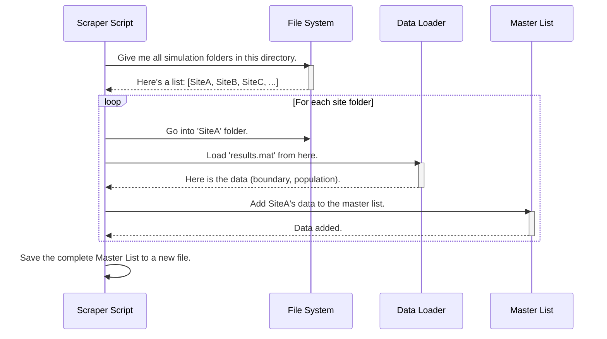

# Chapter 6: Results Aggregation and Data Scraping

In the [previous chapter](05_visualization_and_reporting_.md), we learned how to turn the results of a single simulation into beautiful maps and detailed reports. This is perfect when you're studying one site. But what happens when you run a nationwide analysis with simulations for hundreds of different sites? You'd end up with hundreds of separate folders, each containing its own set of maps, reports, and data files.

Trying to get a big-picture view from this would be a nightmare! How would you find the total population affected across all sites? Or create a single map showing every interference zone in the country? Manually opening hundreds of files is not an option.

This is the exact problem that **Results Aggregation and Data Scraping** is designed to solve. It's the data harvesting step of our project.

### The Digital Librarian

Imagine you're a librarian who has been asked to find the first sentence of every book in a specific section of the library. You wouldn't ask someone to bring every book to your desk. Instead, you would go down the aisle, pull each book off the shelf one by one, open it to the first page, copy down the first sentence, and then put the book back. At the end, you would have a single, clean list with all the information you need.

Our data scraping scripts work exactly like this librarian. They automatically go through every single simulation folder, "pull out" the specific pieces of data we care about (like the final interference boundary or the total affected population), and compile everything into a few "master" files. This turns a messy pile of distributed results into a clean, centralized dataset ready for large-scale analysis.


*Our scraping script acts like a librarian, visiting each simulation folder to collect the important results and compile them into a master list.*

### How It Works: The Big Picture

These scraping scripts, with names like `scrap_data_...rev7.m` or `scrap_data_...rev8.m`, are designed for one primary task: gathering scattered data.

**Inputs:**
*   The path to a main directory that contains all the individual simulation folders (e.g., `C:\Simulations\Study_123\`).
*   A list of the specific data files to look for inside each folder (e.g., files ending in `_cell_bound_miti.mat`).

**Core Logic:**

The script performs a simple, repetitive loop:
1.  **Get a List of Folders:** First, it gets a list of all the simulation sub-folders in the main directory.
2.  **Loop and Visit:** It then goes through this list one by one. In each loop iteration, it:
    a.  Enters a simulation folder.
    b.  Loads the specific `.mat` file containing the results we need.
    c.  Extracts the required data (like boundary coordinates and population counts).
    d.  Adds this data to a growing "master list" (a MATLAB cell array).
    e.  Exits the folder and moves to the next one.
3.  **Save the Master List:** Once it has visited every folder, it saves the complete master list to a new `.mat` file in the main directory.

**Outputs:**
*   One or more master `.mat` files (like `cell_convex_zones.mat`) that contain the aggregated data from all simulations.
*   Often, it will also generate summary reports, like a single Excel file or a KML file showing all the zones on one map.

### Under the Hood: The Scraping Process

Let's visualize how a scraping script gathers all this information.



1.  **Scraper Script**: The main script (`scrap_data_...m`) starts the process.
2.  **File System**: It first asks the file system for a list of all the sub-folders to visit.
3.  **Loop**: It then begins its main loop. For each folder:
    *   It navigates into the directory.
    *   It tells the **Data Loader** to load the specific results file.
    *   It takes the loaded data and adds it to the **Master List** (which is just a variable in memory).
4.  **Save**: After the loop finishes, the script saves the final, aggregated master list to disk.

### Diving Deeper into the Code

Let's look at some simplified code from a script like `scrap_data_pop_geo_id_pea_rev8.m` to see how this works.

First, the script gets a list of all the simulation folders it needs to process.

```matlab
% rev_folder is the main directory containing all the simulation results.
% This helper function returns a list of all sub-folder names.
[sim_number, folder_names, num_folders] = check_rev_folders(app, rev_folder);
```
`folder_names` is now a list, like `{'Site_A', 'Site_B', 'Site_C'}`.

Next, the script sets up empty "master lists" to hold the data it's about to collect. These are called cell arrays in MATLAB.

```matlab
% Pre-allocate empty cell arrays to store the results.
cell_coordination_kml = cell(num_folders, 3); % For KML data (Name, Lat, Lon)
cell_convex_zones = cell(num_folders, 2);     % For zone data (Name, Boundary)
cell_table_all_pop = cell(num_folders, 2);    % For population data (Name, Pop)
```

Now comes the main loop, the heart of the scraper. It iterates through every folder name.

```matlab
% Loop through every folder we found.
for folder_idx = 1:1:num_folders
    % Get the name of the current folder.
    sim_folder = folder_names{folder_idx};
    
    % Navigate into that simulation's directory.
    cd(sim_folder);
    
    % ... more code to load and extract data will go here ...
    
    % Navigate back to the parent directory to get ready for the next loop.
    cd(rev_folder);
end
```
The `cd()` command is like double-clicking on a folder to enter it. This is how the script "visits" each result set.

Inside the loop, it loads the relevant `.mat` file and extracts the information.

```matlab
% Inside the loop for each folder...

% Define the name of the results file we want to load.
file_to_load = strcat('cell_bound_', string_prop_model, '_', sim_number, '_', sim_folder, '.mat');

% Load the data from that file into memory.
load(file_to_load, 'cell_bound_miti');

% Extract the site name and the boundary coordinates.
site_name = sim_folder;
boundary_data = cell_bound_miti{1, 3}; % Column 3 has the convex boundary.
population_data = cell_bound_miti{1, 8}; % Column 8 has the population.

% Add the extracted data to our master lists.
cell_convex_zones{folder_idx, 1} = site_name;
cell_convex_zones{folder_idx, 2} = boundary_data;
cell_table_all_pop{folder_idx, 1} = site_name;
cell_table_all_pop{folder_idx, 2} = population_data;
```
This is the "librarian" step. The script opens the book (`load`), finds the information (`cell_bound_miti{...}`), and writes it down in its master notebook (`cell_convex_zones{...}`).

Finally, after the loop has visited all the folders, the script saves the completed master lists.

```matlab
% After the loop is finished...

% Define the output filename for our master list of zones.
filename_cell_convex_zone = strcat('cell_convex_zones_master.mat');

% Save the aggregated data to a new .mat file.
save(filename_cell_convex_zone, 'cell_convex_zones');

% We can also write the population data to a summary Excel file.
table_full_pop_data = cell2table(cell_table_all_pop);
writetable(table_full_pop_data, 'Master_Population_Report.xlsx');
```
Now, instead of hundreds of scattered files, we have one master `.mat` file with all the boundaries and one clean Excel report with all the population numbers.

### Conclusion

In this chapter, we learned about the essential "housekeeping" step of **Results Aggregation and Data Scraping**. We saw how these scripts act like a digital librarian, systematically visiting hundreds of simulation folders to harvest and compile key results into unified, master datasets. This process is what enables us to perform large-scale analysis and see the big picture across many different sites and scenarios.

We've gathered all of our individual interference zones (polygons) into a single list. What's the next logical step? We can start treating them as a single, collective entity. What if we want to merge all of these overlapping zones into one giant national interference map? That's exactly what we'll learn about in the next chapter, [Polygon Merging and Overlap Analysis](07_polygon_merging_and_overlap_analysis_.md).

---

Generated by [AI Codebase Knowledge Builder](https://github.com/The-Pocket/Tutorial-Codebase-Knowledge)