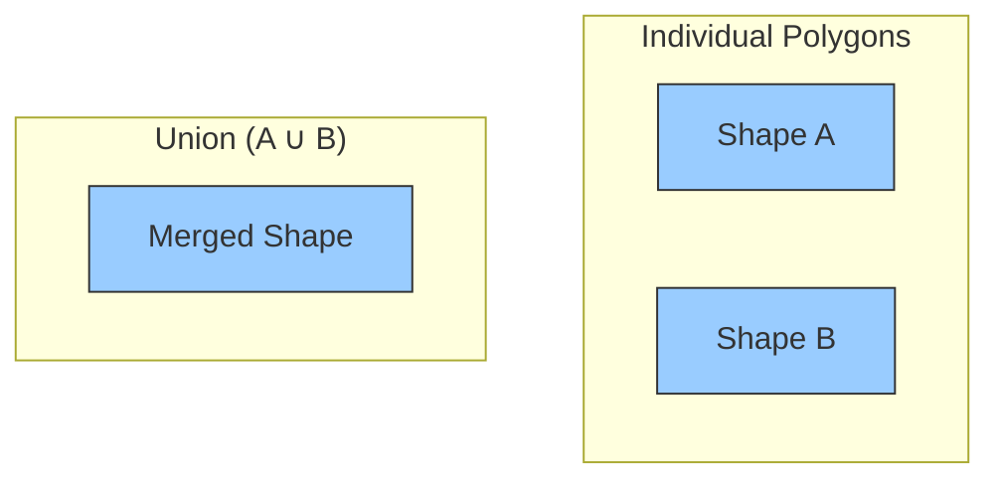
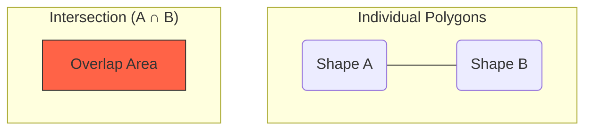
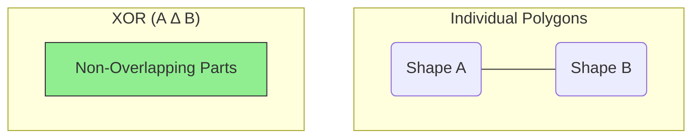
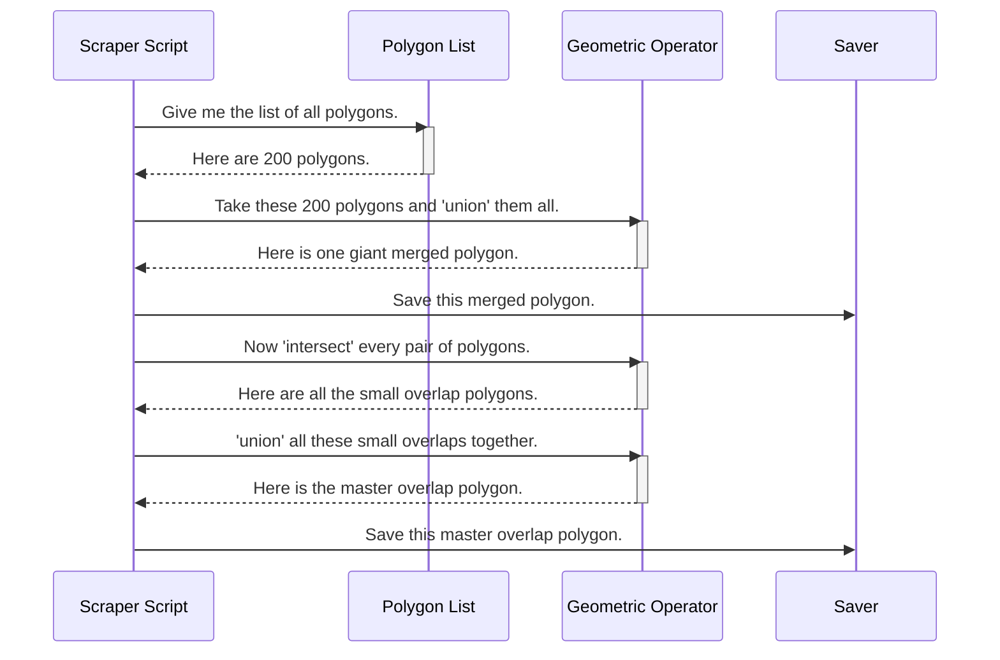

# Chapter 7: Polygon Merging and Overlap Analysis

In the [previous chapter](06_results_aggregation_and_data_scraping_.md), we acted like a diligent librarian, gathering up all the individual interference "bugsplat" reports from hundreds of separate simulation folders. We now have a master list containing hundreds of polygons, each one representing a coordination zone for a specific site.

That's a great start, but a list of shapes isn't the same as a single, unified map. How do we see the *total* area covered by all these zones combined? More importantly, how do we find the "hotspots"—the critical areas where multiple zones overlap, potentially leading to more significant restrictions?

This is the job of **Polygon Merging and Overlap Analysis**. This module takes our big list of individual polygons and uses powerful geometric tools to stitch them together into a single, nationwide picture. It's like taking hundreds of individual property maps and merging them into one master county map, highlighting exactly where different properties overlap.

---

### A Toolkit for Geographic Shapes

To understand the nationwide impact, we need to perform operations on our collection of polygons. Think of it like a toolkit for working with shapes. Our toolkit has three main tools:

#### 1. Union (Merge): Stitching It All Together

The `union` operation takes all our individual polygons, even if they overlap, and merges them into a single, continuous shape. It dissolves the internal boundaries, giving us the total footprint of all zones combined.


*Analogy: If you spill two overlapping puddles of water, the `union` is the final outline of the single, large puddle they form.*

#### 2. Intersection (Overlap): Finding the Shared Space

The `intersect` operation finds only the areas where two or more polygons overlap. This is crucial for identifying regions that are affected by multiple interference sources at the same time. These are often the most critical areas to analyze.


*Analogy: If you lay two sheets of colored cellophane on top of each other, the `intersection` is the area where the colors mix and become darker.*

#### 3. XOR (Exclusive Or): Finding the Unique Parts

The `xor` (or "symmetric difference") operation finds the parts of the polygons that do *not* overlap. It gives you the total area covered by either shape, but not both. This helps isolate the areas that are only affected by a single interference zone.


*Analogy: This is like taking two overlapping cookie cutter shapes, stamping them on dough, and then removing the part where they overlapped, leaving only the unique outer pieces.*

### How It Works: Creating the Master Map

This analysis is typically performed by our [Results Aggregation and Data Scraping](06_results_aggregation_and_data_scraping_.md) scripts (like `scrap_data_...m`) right after they've finished collecting all the individual polygons.

**Inputs:**
*   A master list of all the individual coordination zone polygons we collected (`cell_convex_zones`).

**Core Logic:**
1.  **Merge Everything:** The script takes the entire list of polygons and applies the `union` operation repeatedly until they are all stitched into one giant national polygon.
2.  **Find All Overlaps:** It then systematically compares every pair of polygons in the list (`A` with `B`, `A` with `C`, `B` with `C`, etc.) and uses the `intersect` operation to find every little piece of overlapping area. It then merges all these small overlap pieces into one "master overlap" polygon.
3.  **Calculate the Unique Areas:** Finally, it takes the result from step 1 (the total merged area) and the result from step 2 (the total overlap area) and uses the `xor` operation to find the total area that is *not* part of an overlap.

**Outputs:**
*   `cell_poly_merge.mat`: A file containing the single, massive polygon representing the total national footprint.
*   `cell_overlap_poly.mat`: A file containing all the areas where two or more zones overlap.
*   `cell_xor_poly.mat`: A file containing all the areas that are part of only one zone.

### Under the Hood: The Geometric Engine

Let's visualize the process flow inside a helper script like `polymerge_multi_miti_rev1.m`.



The script first gets the list of polygons, then calls the geometric operator (`union`, `intersect`, etc.) to perform the calculations, and finally saves the results.

### Diving Deeper into the Code

These operations are handled in helper functions like `polymerge_multi_miti_rev1.m`, called by the main scraping script. Let's see how it works.

#### 1. Merging All Polygons with `union`

The script starts by creating one big shape. It takes the first polygon, then loops through the rest, merging them in one by one.

```matlab
% In polymerge_multi_miti_rev1.m

% Loop through all the individual site polygons
for site_idx = 1:1:num_site
    temp_poly = cell_ind_poly{bound_idx, site_idx}; % Get one polygon
    
    if site_idx == 1
        temp_merge = temp_poly; % Start the merged shape with the first polygon
    else
        % Merge the current polygon with our growing master shape
        temp_merge = union(temp_merge, temp_poly);
    end
end
cell_poly_merge{bound_idx} = temp_merge; % Save the final merged shape
```
The `union()` function does all the heavy lifting of figuring out how to combine the two shapes. After this loop, `temp_merge` holds the single polygon for the entire country.

#### 2. Finding All Overlaps with `intersect`

Next, the script needs to find every single spot where zones overlap. It does this with a nested loop that compares every polygon against every other polygon.

```matlab
% In polymerge_multi_miti_rev1.m

% Loop through all pairs of polygons to find where they overlap
for i = 1:num_site
    i_poly = temp_ind_polys{i};
    for j = i+1:1:num_site % Start j from i+1 to avoid re-checking pairs
        j_poly = temp_ind_polys{j};
        
        % Find the geometric intersection of these two polygons
        overlap_piece = intersect(i_poly, j_poly);
        
        % ... code here to add 'overlap_piece' to a list ...
    end
end
% ... finally, union all the collected overlap_pieces into one shape ...
```
This process can be computationally intensive, but it gives us a precise map of all the "hotspots."

#### 3. Visualizing the Merged and Overlapping Zones

Once we have these master polygons, we can easily visualize them. A script like `plot_nationwide_single_overlap_rev1.m` plots the results on a national map.

```matlab
% In plot_nationwide_single_overlap_rev1.m

% Convert our shapes to a format the map can use
[temp_geo_poly] = convert_polyshape2geopolyshape(app, temp_merge);
[temp_geo_overlap] = convert_polyshape2geopolyshape(app, temp_overlap_poly);

% Plot the total merged area in blue
geoplot(temp_geo_poly, 'FaceColor', 'b', 'EdgeColor', 'k');
hold on;

% Plot the overlapping areas in red on top for emphasis
geoplot(temp_geo_overlap, 'FaceColor', 'r', 'FaceAlpha', 0.7);
```
This simple plotting code produces a powerful result: a nationwide map showing the total interference footprint (in blue) with all the multi-zone overlap areas clearly highlighted (in red).

### Conclusion

In this chapter, we learned how to transform a simple list of hundreds of polygons into a powerful, consolidated national view. Using the geometric tools of `union`, `intersect`, and `xor`, we can merge individual zones, identify critical overlaps, and understand the complete nationwide impact of our simulations. This analysis is the key to moving from site-specific results to a true big-picture understanding.

We've now followed the entire analysis pipeline, from setting up a single simulation grid to creating a merged national impact map. But doing all of this for hundreds of sites is a huge computational task that could take days on a normal computer. How does the project handle this challenge? The final chapter, [Distributed Task Management](08_distributed_task_management_.md), reveals how `Generic_Bugsplat` uses parallel processing to drastically speed up these massive simulations.

---

Generated by [AI Codebase Knowledge Builder](https://github.com/The-Pocket/Tutorial-Codebase-Knowledge)