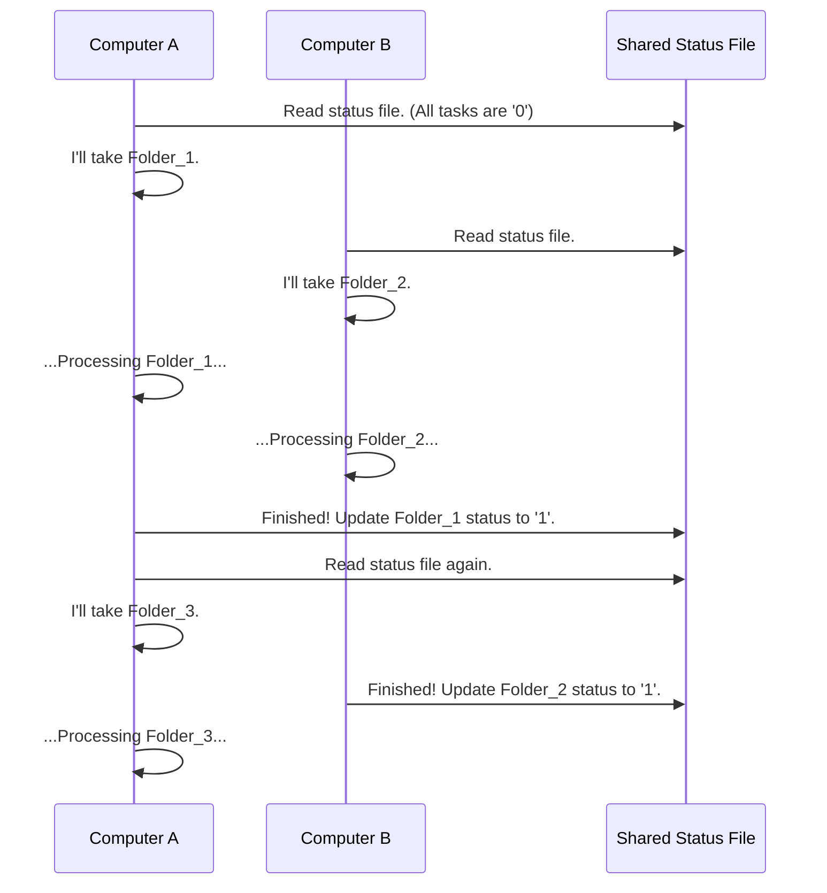

# Chapter 8: Distributed Task Management

In the [previous chapter](07_polygon_merging_and_overlap_analysis_.md), we saw how to merge hundreds of individual interference polygons into a single, massive national map. Running the simulations to create those hundreds of polygons is a huge job that could take days or even weeks on a single computer. How can we possibly manage and speed up such a large-scale task?

This is where the project's "project manager" comes in: **Distributed Task Management**. This is the clever system that allows us to break a giant simulation job into hundreds of small pieces and share the work across multiple computers. It ensures that no work is ever duplicated and that we can stop and restart the entire process at any time without losing our progress.

### The Shared Whiteboard Analogy

Imagine you and a team of colleagues have a list of 100 tasks to complete. To coordinate, you use a large whiteboard in the office.

1.  **The To-Do List:** The project manager writes all 100 tasks on the left side of the board.
2.  **Picking a Task:** You walk up to the board, find a task that isn't checked off, and write your name next to it. This signals to everyone else, "I'm working on this one!"
3.  **Doing the Work:** You go to your desk and complete the task.
4.  **Marking it Done:** When you're finished, you walk back to the whiteboard and put a big checkmark next to the task. It's now officially complete.

If the power goes out, it's no big deal. When it comes back on, your team can just look at the whiteboard to see which tasks are checked off and which ones are still open, and they can pick up right where they left off.

Our Distributed Task Management system works in exactly the same way. The "whiteboard" is a special file on a shared network drive, and the "colleagues" are different computers (or even different instances of the script running on the same computer).

### How It Works: The Status File

The heart of this system is a simple file called a **status file** (e.g., `cell_8_grid_points_status.mat`). This file is our shared whiteboard. It's a simple table with two columns:

*   **Column 1: Task Name.** This is usually the name of a simulation folder (e.g., `Site_A`).
*   **Column 2: Status.** This is a number: `0` for "Not Done" or `1` for "Done."

When a large simulation starts, a script first checks for this file.
*   **If the file doesn't exist:** It creates a new one, listing every single simulation folder that needs to be processed and marking them all with a `0`.
*   **If the file already exists:** It simply loads it, reading the current status of every task.

A script instance (our "worker") then follows these steps:
1.  It reads the status file to find a task marked with `0`.
2.  It runs the necessary simulation for that folder.
3.  Once the simulation is successfully completed, it updates the status file, changing the `0` to a `1` for that task.
4.  It then goes back to step 1 to find the next available task.

This simple "check-work-update" loop allows dozens of computers to collaborate on the same massive job without ever stepping on each other's toes.

### Under the Hood: A Tale of Two Computers

Let's visualize how two computers, `A` and `B`, might work together on a simulation with 5 folders.


In this scenario, `A` and `B` work in parallel. They each check the shared list, pick a different open task, and get to work. When they finish, they update the list, ensuring that when they look for their next task, they don't accidentally re-do work that another computer has already completed.

### Diving Deeper into the Code

Let's look at the three key functions that make this system work. We'll use the task of generating simulation grids (from [Chapter 3](03_geographic_simulation_grid_generation_.md)) as our example.

#### 1. Creating or Loading the "Whiteboard"

The `initialize_or_load_generic_status_rev1.m` function is responsible for the whiteboard. It's the first thing that gets called.

```matlab
% In initialize_or_load_generic_status_rev1.m

% Does the status file already exist?
if exist(cell_status_filename, 'file')
    % Yes, so just load it into memory.
    load(cell_status_filename, 'cell_status');
else
    % No, so we need to create it for the first time.
    % 'folder_names' is a list of all simulation folders.
    num_folders = length(folder_names);
    cell_status = cell(num_folders, 2);  % Create a 2-column list
    cell_status(:, 1) = folder_names;    % Column 1: Task Name
    cell_status(:, 2) = {0};             % Column 2: Status (0 = Not Done)
    
    % Save our new "to-do list" to the shared drive.
    save(cell_status_filename, 'cell_status');
end
```
This code perfectly mirrors our analogy: it either finds the existing whiteboard or draws a brand new one with all tasks listed and unchecked.

#### 2. The Worker Loop: Finding and Doing Tasks

A worker script like `part0_grid_pts_azi_pathloss_rev4_server.m` contains the main loop that gets the work done.

```matlab
% In part0_..._server.m

% First, load our shared to-do list.
[cell_status] = initialize_or_load_generic_status_rev1(...);

% Find all the tasks that are not yet done (where status is 0).
zero_idx = find(cell2mat(cell_status(:,2)) == 0);

% Loop through the list of unfinished tasks.
for folder_idx = 1:1:length(zero_idx)
    % IMPORTANT: Re-load the list one last time before starting work.
    % This prevents a race condition where another computer just finished this task.
    [cell_status] = initialize_or_load_generic_status_rev1(...);
    
    sim_folder = ... % Get the folder name for this task.
    
    if cell_status{...} == 0 % Is it STILL not done?
        % Yes! It's ours. Let's do the work.
        disp(strcat('Starting work on: ', sim_folder));
        % ... (code to generate the grid for this folder runs here) ...
        
        % Now, mark it as complete on the public whiteboard.
        [cell_status] = update_generic_status_cell_rev1(...);
    end
end
```
The most critical part here is the "double-check." The script checks the list once to get a set of tasks, but just before it begins a specific task, it checks again. This ensures that no two computers can ever start working on the same task at the exact same moment.

#### 3. Marking a Task as "Done"

Finally, `update_generic_status_cell_rev1.m` is the simple but vital function that puts the checkmark on our whiteboard.

```matlab
% In update_generic_status_cell_rev1.m

% Load the latest version of the shared status file.
[cell_status] = initialize_or_load_generic_status_rev1(...);
    
% Find which row in the list corresponds to the folder we just finished.
temp_cell_idx = find(strcmp(cell_status(:,1), sim_folder) == 1);

% Update the status in that row from 0 to 1 ("Done").
cell_status{temp_cell_idx, 2} = 1;
    
% Save the updated list back to the shared file for everyone to see.
save(cell_status_filename, 'cell_status');
```
This function is called right after a simulation task is completed successfully. It makes the progress public, preventing any other worker from re-doing the job.

### Conclusion

In this final chapter, we've pulled back the curtain on how `Generic_Bugsplat` handles massive, time-consuming jobs. By using a simple but robust system of shared status files, the project can distribute work across multiple computers, dramatically reducing the time it takes to run a large-scale analysis. This "shared whiteboard" approach provides efficiency, prevents duplicated effort, and makes the entire system resilient to interruptions.

Congratulations! You've completed the tour of the `Generic_Bugsplat` project's core concepts. We've journeyed from drawing a single interference boundary in [Chapter 1](01_coordination_zone_delineation_.md), to automating entire workflows with an [Orchestrator](02_simulation_workflow_orchestrator_.md), analyzing real-world [impact](04_population___pea_impact_analysis_.md), and finally, aggregating and merging results on a [national scale](07_polygon_merging_and_overlap_analysis_.md). You now have a foundational understanding of how this powerful tool transforms raw data into meaningful, large-scale interference analysis.

---

Generated by [AI Codebase Knowledge Builder](https://github.com/The-Pocket/Tutorial-Codebase-Knowledge)