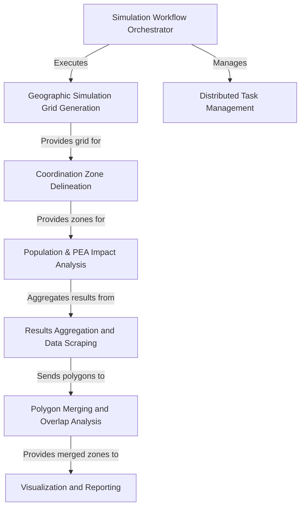

# Tutorial: Generic_Bugsplat

This project is a simulation tool for analyzing **radio frequency (RF) interference**. It works by first generating a *geographic grid* around specific sites, then calculating signal loss to determine potential interference areas. These areas are delineated as **coordination zones**, which are essentially 'keep-out' zones. The system quantifies the real-world impact by analyzing how these zones affect *population and economic areas*, and finally generates visual reports like maps and data tables.

**Source Repository:** [Generic_Bugsplat](https://github.com/nicklasorte/Generic_Bugsplat)

## Chapters

1. [Coordination Zone Delineation
](01_coordination_zone_delineation_.md)
2. [Simulation Workflow Orchestrator
](02_simulation_workflow_orchestrator_.md)
3. [Geographic Simulation Grid Generation
](03_geographic_simulation_grid_generation_.md)
4. [Population & PEA Impact Analysis
](04_population___pea_impact_analysis_.md)
5. [Visualization and Reporting
](05_visualization_and_reporting_.md)
6. [Results Aggregation and Data Scraping
](06_results_aggregation_and_data_scraping_.md)
7. [Polygon Merging and Overlap Analysis
](07_polygon_merging_and_overlap_analysis_.md)
8. [Distributed Task Management
](08_distributed_task_management_.md)

---

Generated by [AI Codebase Knowledge Builder](https://github.com/The-Pocket/Tutorial-Codebase-Knowledge)
